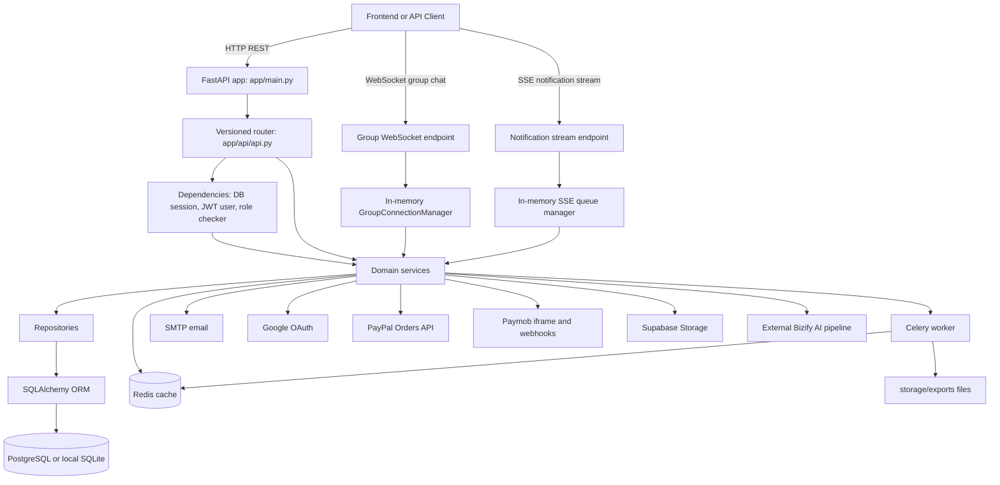

# Bizify — Overview & Architecture

## 1. System Overview

Bizify is a FastAPI backend for an AI-assisted business strategy platform. It supports entrepreneurs from account creation through onboarding, skill capture, idea creation, AI analysis, team collaboration, partner discovery, subscription billing, document import, export jobs, notifications, and administrative review.

The project is backend-first. It exposes versioned REST APIs under `/api/v1`, WebSocket chat for group collaboration, Server-Sent Events for notifications, SQLAlchemy models for the domain database, Alembic migrations for schema evolution, Celery for background exports, Redis for cache and worker transport, and external integrations for Google OAuth, SMTP email, PayPal, Paymob, Supabase Storage, and an external Bizify AI pipeline.

### User Personas

| Persona | Capabilities |
|---|---|
| **Entrepreneur** | Register, verify account, complete onboarding questionnaire, manage profile and skills, create and filter business ideas, run AI analysis, import documents, export data, create collaboration groups, invite members, chat with groups, and manage billing. |
| **Mentor** | Register as a partner, upload supporting documents, wait for admin approval, keep a partner profile, and become discoverable as a business support partner after approval. |
| **Supplier / Manufacturer** | Register as a partner, submit company/service/experience details, upload proof documents, and go through the same admin approval workflow. |
| **Admin** | Review partner applications, approve/reject partners, view security logs, search/delete/promote/suspend users, and inspect dashboard statistics. |

---

## 2. Architecture Diagram

---

## 3. Request Lifecycle

1. `app/main.py` creates the FastAPI app, adds CORS middleware, includes the versioned API router under `/api/v1`, and exposes `/` plus `/health`.
2. `app/api/api.py` mounts feature routers: auth, admin, users, profile, guidance, ideas, notifications, export, settings, import, groups, billing, and AI.
3. Most protected routes call `get_current_user` from `app/api/dependencies.py`.
4. `get_current_user` opens a SQLAlchemy session through `SessionLocal`, reads the bearer token, rejects blacklisted tokens, decodes JWT using `SECRET_KEY` and `ALGORITHM`, loads the user, rejects inactive users, rejects sessions older than `revoked_at` or `last_password_change`, enforces inactivity timeout, updates `last_activity`, and returns the user object.
5. Router functions stay thin. They parse request data and call a service class or module function.
6. Service functions implement business rules and orchestrate repositories, external clients, email, cache, or background jobs.
7. Repositories wrap SQLAlchemy queries and shared CRUD helpers.
8. SQLAlchemy persists domain models to the configured database URL from `.env`.

---

## 4. Layer Responsibilities

| Layer | Files | Responsibility |
|---|---|---|
| **API** | `app/api/v1/*.py` | HTTP status codes, path/query/body parsing, auth dependencies, request/response schemas. |
| **Service** | `app/services/*.py` | Business rules, workflow orchestration, transaction boundaries, external integration calls. |
| **Repository** | `app/repositories/*.py` | SQLAlchemy queries, CRUD helpers, scoped lookups, persistence operations. |
| **Model** | `app/models/*.py` | Tables, columns, relationships, enums, indexes, association tables. |
| **Schema** | `app/schemas/*.py` | Pydantic validation, serialization, examples, enum normalization. |
| **Core** | `app/core/*.py` | Infrastructure configuration, database, security, cache, background worker, email, payment/OAuth clients. |

---

## 5. Project Directory Structure

| Path | Purpose |
|---|---|
| `app/main.py` | FastAPI app factory, CORS, startup SQLite compatibility hook, root and health routes. |
| `app/api/api.py` | Central API router that mounts all `/api/v1` feature routers. |
| `app/api/dependencies.py` | Request-scoped DB sessions, bearer token handling, current-user loading, token blacklist checks, session timeout, and role checking. |
| `app/api/v1/` | HTTP and WebSocket route handlers grouped by feature. |
| `app/services/` | Business workflows: auth, users, profile, skills, ideas, groups, billing, notifications, import, export, guidance, AI pipeline, partners, settings, admin. |
| `app/repositories/` | SQLAlchemy query helpers and shared CRUD repository base class. |
| `app/models/` | SQLAlchemy ORM models, enums, relationships, and many-to-many association tables. |
| `app/schemas/` | Pydantic request/response models and validators. |
| `app/core/` | Configuration, database engine/session, JWT/password helpers, Redis cache, Celery app, email, Google, PayPal, and Paymob clients. |
| `app/sockets/` | In-memory WebSocket manager for group chat. |
| `alembic/` | Database migration environment and migration versions. |
| `scripts/` | Active utility seed scripts for plans and curated skill data. |
| `seed_db/` | Demo and legacy seed scripts for local development data. |
| `smoke_checks/` | Basic app smoke check using FastAPI `TestClient`. |
| `public/index.html` | Minimal Google OAuth test frontend. |
