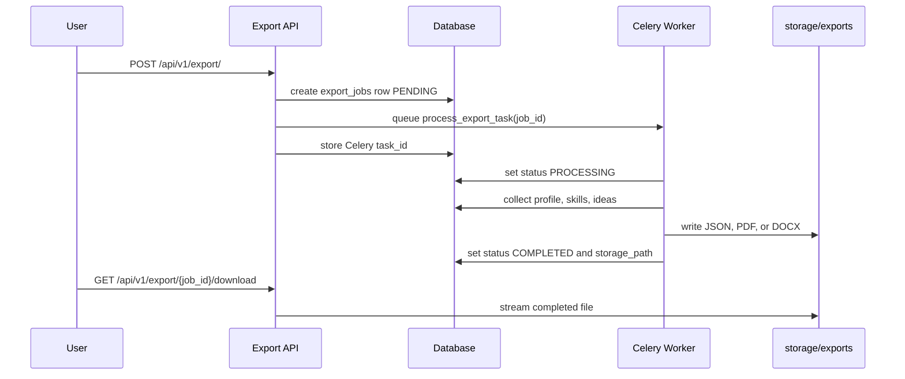
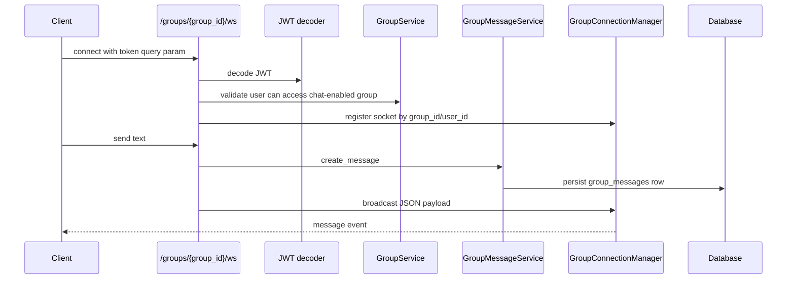
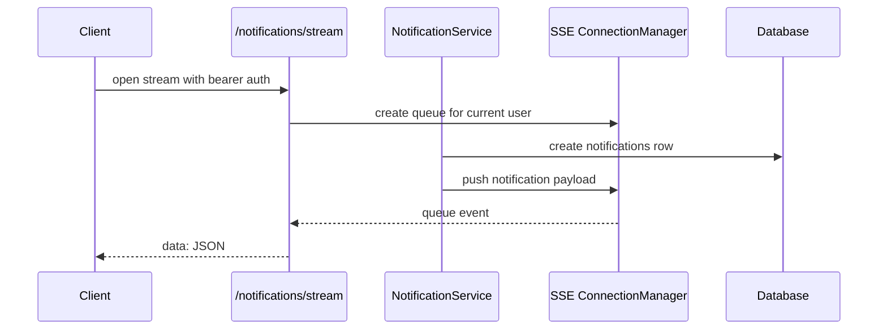
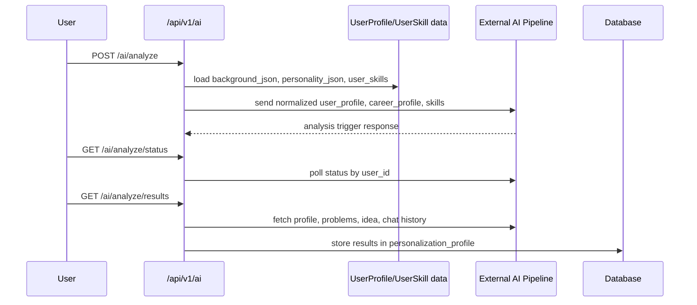

# Bizify — Background & Real-Time Flows

Bizify utilizes background workers and real-time streaming protocols to keep the main HTTP API responsive and enable interactive collaboration.

---

## 1. Data Export Flow (Background Processing)

Data exports (JSON, PDF, DOCX) can take time. Bizify uses **Celery** and **Redis** to run these asynchronously.

---

## 2. Group Chat Flow (WebSockets)

Group chat provides low-latency, real-time collaboration using FastAPI's **WebSocket** implementation backed by an in-memory `GroupConnectionManager`.

---

## 3. Real-Time Notification Flow (SSE)

Instead of bi-directional WebSockets, notifications use **Server-Sent Events (SSE)**, which are easier to implement on the frontend (using `EventSource`) and perfect for one-way server-to-client updates.

---

## 4. External AI Pipeline Flow (Polling)

Integration with the Bizify AI engine involves triggering a remote process and polling for results until completion.

