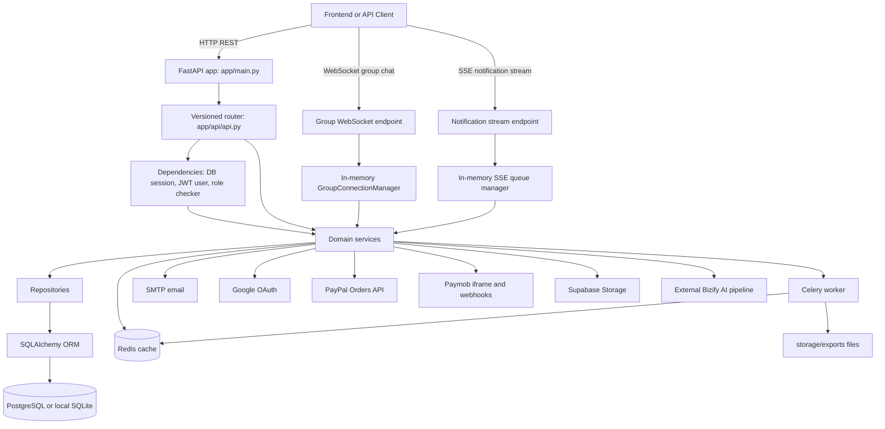
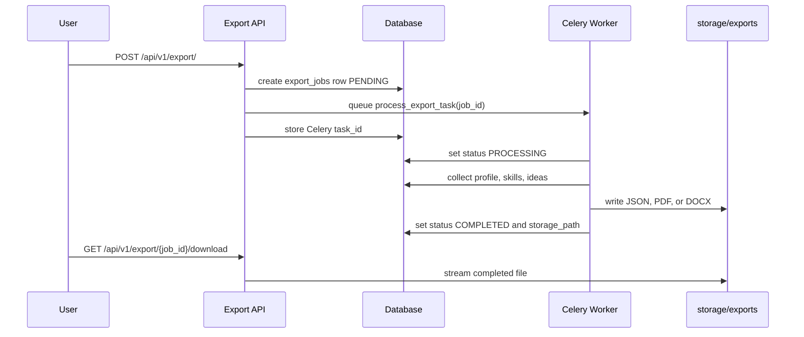
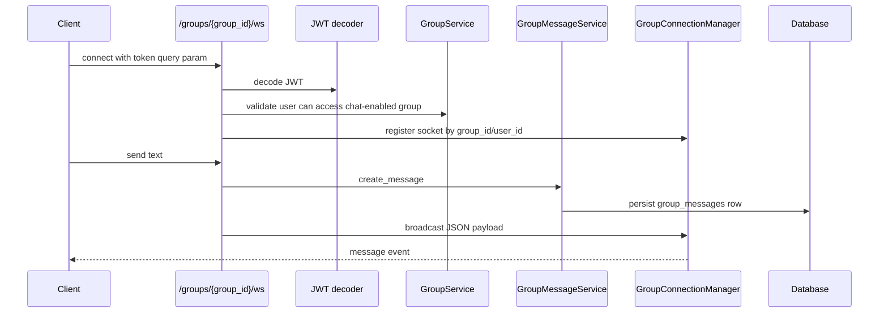
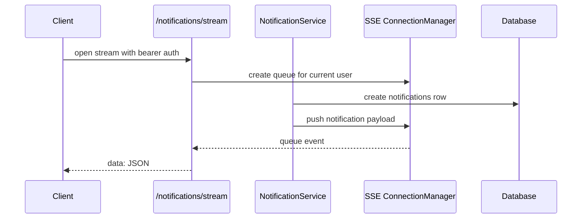
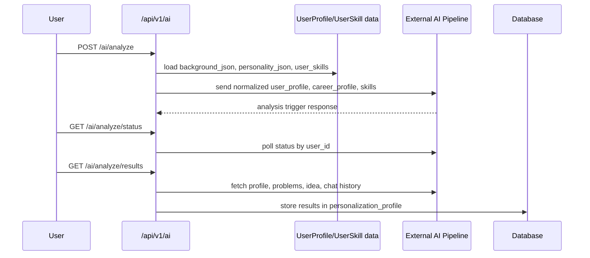

# Bizify Backend — Complete Technical Documentation

> **Version:** `0.1.0`

This document contains the complete technical documentation for the Bizify backend.

---

# Overview & Architecture

## 1. System Overview

Bizify is a FastAPI backend for an AI-assisted business strategy platform. It supports entrepreneurs from account creation through onboarding, skill capture, idea creation, AI analysis, team collaboration, partner discovery, subscription billing, document import, export jobs, notifications, and administrative review.

The project is backend-first. It exposes versioned REST APIs under `/api/v1`, WebSocket chat for group collaboration, Server-Sent Events for notifications, SQLAlchemy models for the domain database, Alembic migrations for schema evolution, Celery for background exports, Redis for cache and worker transport, and external integrations for Google OAuth, SMTP email, PayPal, Paymob, Supabase Storage, and an external Bizify AI pipeline.

### User Personas

| Persona | Capabilities |
|---|---|
| **Entrepreneur** | Register, verify account, complete onboarding questionnaire, manage profile and skills, create and filter business ideas, run AI analysis, import documents, export data, create collaboration groups, invite members, chat with groups, and manage billing. |
| **Mentor** | Register as a partner, upload supporting documents, wait for admin approval, keep a partner profile, and become discoverable as a business support partner after approval. |
| **Supplier / Manufacturer** | Register as a partner, submit company/service/experience details, upload proof documents, and go through the same admin approval workflow. |
| **Admin** | Review partner applications, approve/reject partners, view security logs, search/delete/promote/suspend users, and inspect dashboard statistics. |

---

## 2. Architecture Diagram



---

## 3. Request Lifecycle

1. `app/main.py` creates the FastAPI app, adds CORS middleware, includes the versioned API router under `/api/v1`, and exposes `/` plus `/health`.
2. `app/api/api.py` mounts feature routers: auth, admin, users, profile, guidance, ideas, notifications, export, settings, import, groups, billing, and AI.
3. Most protected routes call `get_current_user` from `app/api/dependencies.py`.
4. `get_current_user` opens a SQLAlchemy session through `SessionLocal`, reads the bearer token, rejects blacklisted tokens, decodes JWT using `SECRET_KEY` and `ALGORITHM`, loads the user, rejects inactive users, rejects sessions older than `revoked_at` or `last_password_change`, enforces inactivity timeout, updates `last_activity`, and returns the user object.
5. Router functions stay thin. They parse request data and call a service class or module function.
6. Service functions implement business rules and orchestrate repositories, external clients, email, cache, or background jobs.
7. Repositories wrap SQLAlchemy queries and shared CRUD helpers.
8. SQLAlchemy persists domain models to the configured database URL from `.env`.

---

## 4. Layer Responsibilities

| Layer | Files | Responsibility |
|---|---|---|
| **API** | `app/api/v1/*.py` | HTTP status codes, path/query/body parsing, auth dependencies, request/response schemas. |
| **Service** | `app/services/*.py` | Business rules, workflow orchestration, transaction boundaries, external integration calls. |
| **Repository** | `app/repositories/*.py` | SQLAlchemy queries, CRUD helpers, scoped lookups, persistence operations. |
| **Model** | `app/models/*.py` | Tables, columns, relationships, enums, indexes, association tables. |
| **Schema** | `app/schemas/*.py` | Pydantic validation, serialization, examples, enum normalization. |
| **Core** | `app/core/*.py` | Infrastructure configuration, database, security, cache, background worker, email, payment/OAuth clients. |

---

## 5. Project Directory Structure

| Path | Purpose |
|---|---|
| `app/main.py` | FastAPI app factory, CORS, startup SQLite compatibility hook, root and health routes. |
| `app/api/api.py` | Central API router that mounts all `/api/v1` feature routers. |
| `app/api/dependencies.py` | Request-scoped DB sessions, bearer token handling, current-user loading, token blacklist checks, session timeout, and role checking. |
| `app/api/v1/` | HTTP and WebSocket route handlers grouped by feature. |
| `app/services/` | Business workflows: auth, users, profile, skills, ideas, groups, billing, notifications, import, export, guidance, AI pipeline, partners, settings, admin. |
| `app/repositories/` | SQLAlchemy query helpers and shared CRUD repository base class. |
| `app/models/` | SQLAlchemy ORM models, enums, relationships, and many-to-many association tables. |
| `app/schemas/` | Pydantic request/response models and validators. |
| `app/core/` | Configuration, database engine/session, JWT/password helpers, Redis cache, Celery app, email, Google, PayPal, and Paymob clients. |
| `app/sockets/` | In-memory WebSocket manager for group chat. |
| `alembic/` | Database migration environment and migration versions. |
| `scripts/` | Active utility seed scripts for plans and curated skill data. |
| `seed_db/` | Demo and legacy seed scripts for local development data. |
| `smoke_checks/` | Basic app smoke check using FastAPI `TestClient`. |
| `public/index.html` | Minimal Google OAuth test frontend. |


---

# Bizify Database Schema Documentation

This document provides a comprehensive overview of the Bizify database schema, organized by domain. All tables include standard `id` (UUID), `created_at`, and `updated_at` columns unless otherwise specified.

## 1. Core User Management

### `users`
Represents a system user.
- **Fields:** `email`, `password_hash`, `google_id`, `full_name`, `role` (ADMIN, USER, ENTREPRENEUR, MENTOR, SUPPLIER, MANUFACTURER), `is_active`, `is_verified`, `failed_login_attempts`, `locked_until`, `last_activity`, `revoked_at`, `last_password_change`
- **Relationships:** `profile`, `ideas`, `businesses`, `subscriptions`, `payment_methods`, `payments`, `usages`, `notifications`, `notification_settings`, `privacy_settings`, `files`, `partner_profile`, `admin_logs`, `comparisons`, `share_links`, `chat_sessions`, `group_messages`, `verification_codes`

### `user_profiles`
Detailed profile information for a user.
- **Fields:** `user_id`, `bio`, `skills_json`, `guide_status`, `interests_json`, `preferences_json`, `risk_profile_json`, `onboarding_completed`, `background_json`, `personality_json`, `personalization_profile`

### `privacy_settings`
User privacy preferences.
- **Fields:** `user_id`, `visibility` (public, private, team_only), `show_contact_info`

### `account_verifications`
OTP tokens for account verification, password reset, or email change.
- **Fields:** `user_id`, `otp_hash`, `verification_type`, `expires_at`

## 2. Idea & Business Management

### `ideas`
A business idea in the system.
- **Fields:** `owner_id`, `business_id` (optional), `title`, `description`, `status` (DRAFT, VALIDATED, CONVERTED), `ai_score`, `budget`, `skills` (JSON), `feasibility`, `is_score_outdated`, `is_archived`, `archived_at`, `converted_at`
- **Relationships:** `versions`, `metrics`, `experiments`, `share_links`, `chat_sessions`, `comparison_items`

### `businesses`
A validated business built from an idea.
- **Fields:** `idea_id`, `owner_id`, `stage` (EARLY, BUILDING, SCALING), `context_json`, `is_archived`, `archived_at`
- **Relationships:** `groups`, `roadmap`, `partner_requests`, `embeddings`, `chat_sessions`, `share_links`

## 3. Collaboration & Groups

### `groups`
Organizational group within a business.
- **Fields:** `business_id`, `name`, `description`, `default_role`, `is_chat_enabled`
- **Relationships:** `members`, `invites`, `join_requests`, `messages`

### `group_members`
A user's membership and role in a group.
- **Fields:** `group_id`, `user_id`, `role` (OWNER, EDITOR, VIEWER), `status` (ACTIVE, REMOVAL_PENDING), `joined_at`

### `group_invites` & `group_join_requests`
Workflows for adding users to groups.
- **Invites:** `group_id`, `email`, `token`, `role`, `status` (PENDING, ACCEPTED, EXPIRED), `invited_by`, `expires_at`
- **Requests:** `group_id`, `user_id`, `role`, `status` (pending, approved, rejected)

### Association Tables (Many-to-Many)
Control which ideas each member/invite/request has access to within a group.

| Table | Columns | Description |
|---|---|---|
| `group_member_idea_access` | `member_id` → `group_members.id`, `idea_id` → `ideas.id` | Ideas accessible to a specific group member |
| `group_invite_idea_access` | `invite_id` → `group_invites.id`, `idea_id` → `ideas.id` | Ideas pre-granted to an invited user |
| `group_request_idea_access` | `request_id` → `group_join_requests.id`, `idea_id` → `ideas.id` | Ideas requested as part of a join request |

### `group_messages`
Real-time user-to-user chat within a group.
- **Fields:** `group_id`, `sender_id`, `content`

### `share_links`
Public or private shared links for an Idea or Business.
- **Fields:** `idea_id`, `business_id`, `created_by`, `token`, `is_public`, `expires_at`

## 4. Skills & Partners

### `skill_categories` & `predefined_skills` & `user_skills`
Categorized list of skills and what users claim.
- **Categories:** `name`, `description`
- **Predefined Skills:** `name`, `category_id`
- **User Skills:** `user_id`, `skill_name`, `is_custom`, `predefined_skill_id`, `category_id`

### `partner_profiles` & `partner_requests`
Mentor, supplier, or manufacturer profiles and collaboration requests.
- **Profiles:** `user_id`, `partner_type`, `company_name`, `description`, `services_json`, `experience_json`, `documents_json`, `approval_status`, `approved_by`, `approved_at`
- **Requests:** `business_id`, `partner_id`, `requested_by`, `status`

## 5. Roadmap & Guidance

### `business_roadmaps` & `roadmap_stages`
Step-by-step plan for a business.
- **Roadmaps:** `business_id`, `completion_percentage`
- **Stages:** `roadmap_id`, `order_index`, `stage_type`, `status` (LOCKED, ACTIVE, COMPLETED), `output_json`, `completed_at`

### `guidance_stages` & `guidance_concepts`
System-provided guidance content.
- **Stages:** `name`, `description`, `sequence_order`
- **Concepts:** `stage_id`, `title`, `concept_explanation`, `platform_support_explanation`, `sequence_order`, `is_available`

### `feature_concept_mappings` & `user_concept_states`
Connecting platform UI features to concepts and tracking user reading progress.

## 6. AI & Agents

### `agents` & `agent_runs`
AI agents and their execution records.
- **Agents:** `name`, `phase`
- **Runs:** `stage_id`, `agent_id`, `input_data`, `output_data`, `confidence_score`, `status`, `execution_time_ms`

### `embeddings`
Vector embeddings of business context for RAG.
- **Fields:** `business_id`, `agent_id`, `content`, `vector`

### `chat_sessions` & `chat_messages`
Conversations with the AI.
- **Sessions:** `user_id`, `business_id`, `idea_id`, `session_type`, `conversation_summary_json`
- **Messages:** `session_id`, `role` (USER, AI), `content`

### `documents`
Processed files with extracted text for AI.
- **Fields:** `filename`, `content_type`, `extracted_text`, `user_id`

## 7. Idea Analysis & Evaluation

### `idea_versions`
Versioned snapshots of an idea's state.
- **Fields:** `idea_id`, `created_by`, `snapshot_json`

### `idea_metrics`
Numerical metrics tracked over time for an idea.
- **Fields:** `idea_id`, `created_by`, `name`, `value`, `type`, `recorded_at`

### `idea_comparisons` & `comparison_items` & `comparison_metrics`
Grouping ideas to compare them against standard metrics.

### `experiments`
Tests to validate hypotheses for an idea.
- **Fields:** `idea_id`, `created_by`, `hypothesis`, `status`, `result_summary`

## 8. Billing & Resources

### `plans`
Available subscription tiers.
- **Fields:** `name`, `price` (Numeric 10,2), `features_json`, `is_active`

### `subscriptions`
User subscriptions to a plan.
- **Fields:** `user_id`, `plan_id`, `status` (ACTIVE, CANCELED), `start_date`, `end_date`, `paypal_subscription_id`

### `payment_methods`
Saved payment tokens for a user.
- **Fields:** `user_id`, `provider`, `token_ref`, `last4`, `is_default`

### `payments`
Payment transactions (supports PayPal and Paymob).
- **Fields:** `user_id`, `subscription_id`, `payment_method_id`, `amount`, `currency`, `status`, `paypal_order_id`, `paypal_capture_id`, `paymob_order_id`, `paymob_transaction_id`

### `usages`
Tracking resource limits (e.g., AI tokens, storage).
- **Fields:** `user_id`, `resource_type`, `used`, `limit_value`

## 9. Logs & System Tools

### `notifications`
System alerts sent to users.
- **Fields:** `user_id`, `title`, `content`, `message`, `type`, `status` (unread, read, dismissed, archived), `delivery_status` (pending, sent, failed), `retry_count`, `expires_at`
- **Index:** Composite on `(user_id, status, expires_at)` for fast active-notification queries

### `notification_settings`
Per-user notification preferences (1-to-1 with `users`, PK = `user_id`).
- **Fields:** `user_id`, `is_enabled`, `email_enabled`, `sms_enabled`, `push_enabled`, `marketing_enabled`, `team_updates_enabled`, `billing_alerts_enabled`

### `audit_logs`
General record of user actions for compliance.
- **Fields:** `user_id` (nullable), `action`, `details` (JSON), `ip_address`

### `security_logs`
Security-related events (login attempts, lockouts, etc.).
- **Fields:** `user_id` (nullable), `event_type`, `details` (JSON), `ip_address`

### `admin_action_logs`
Audit trail for actions performed by admins.
- **Fields:** `admin_id`, `action_type`, `target_entity`, `target_id`

### `validation_logs`
Output of the AI agent's self-validation step after each run.
- **Fields:** `agent_run_id`, `confidence_score`, `critique_json`, `threshold_passed`

### `export_jobs`
Background jobs for data exports.
- **Fields:** `user_id`, `scope`, `format`, `status`, `storage_path`, `task_id`, `error_details`

### `token_blacklist`
Revoked JWT tokens.

### `files`
User uploaded files (images, attachments).
- **Fields:** `owner_id`, `file_path`, `file_type`, `size`, `uploaded_at`


---

# CRUD Operations Reference

All data access goes through **Repository classes** that extend a shared `BaseRepository`.
Each repository is a singleton instance imported directly (e.g. `idea_repo`, `user_repo`).

---

## Base Repository — Shared Operations

All repositories inherit the following generic operations from `BaseRepository`:

| Method | Signature | Description |
|---|---|---|
| `get` | `(db, id)` | Fetch a single record by primary key |
| `get_multi` | `(db, skip, limit)` | Paginated list of records |
| `create` | `(db, obj_in, commit, refresh)` | Create a new record from a schema or dict |
| `update` | `(db, db_obj, obj_in, commit, refresh)` | Partial update using `exclude_unset` |
| `save` | `(db, db_obj, commit, refresh)` | Persist an already-modified model instance |
| `remove` | `(db, id, commit)` | Delete by primary key |
| `delete_instance` | `(db, db_obj, commit)` | Delete a loaded model instance |

> **Pattern:** `commit=False` uses `db.flush()` to defer the transaction, useful inside multi-step service operations.

---

## 1. Users — `user_repo`

| Method | Description |
|---|---|
| `get_by_email(db, email)` | Fetch user by email address |
| `get_by_google_id(db, google_id)` | Fetch user by Google OAuth ID |
| `get_active_user(db, user_id)` | Fetch active + verified user by ID |
| `get_by_role(db, role)` | List all users with a given role |
| `get_first_by_role(db, role)` | First user matching a role |
| `count_all(db)` | Total number of users |
| `count_inactive(db)` | Total number of inactive users |

---

## 2. User Profiles — `profile_repo`

| Method | Description |
|---|---|
| `get_by_user_id(db, user_id)` | Fetch profile for a user |
| `get_or_create(db, user_id)` | Fetch or lazily create a blank default profile (upsert) |

---

## 3. Ideas — `idea_repo`

| Method | Description |
|---|---|
| `get_by_owner(db, user_id)` | All ideas owned by a user |
| `get_by_business(db, business_id)` | All ideas linked to a business |
| `get_by_ids_in_business(db, idea_ids, business_id)` | Fetch specific ideas scoped to a business boundary |
| `count_all(db)` | Total idea count |
| `mark_scores_outdated(db, owner_id)` | Bulk-flag all of a user's ideas for AI score recalculation |

---

## 4. Groups — `group_repo`

### Group Queries

| Method | Description |
|---|---|
| `get_by_id(db, group_id)` | Fetch group by ID |
| `get_by_business_id(db, business_id)` | All groups belonging to a business |
| `get_user_owned_groups(db, user_id)` | Groups where the user is the business owner |
| `get_user_member_groups(db, user_id)` | Groups where the user is an active member |

### Member Queries

| Method | Description |
|---|---|
| `get_active_members(db, group_id)` | All active members of a group |
| `get_active_members_for_user(db, user_id)` | All active memberships for a user across groups |
| `get_member_by_user_and_group(db, group_id, user_id)` | Single membership record |
| `get_member_by_id(db, member_id)` | Membership by primary key |
| `is_active_member(db, group_id, user_id)` | Boolean membership check |
| `is_member_of_business(db, business_id, user_id)` | Active membership check scoped to a business |

### Member Mutations

| Method | Description |
|---|---|
| `create_member(db, member)` | Save a new GroupMember record |
| `save_member(db, member)` | Persist updates to an existing member |
| `remove_member(db, member)` | Delete a membership record |

### Invites

| Method | Description |
|---|---|
| `get_pending_invite_by_token(db, token)` | Fetch a PENDING invite by its secret token |
| `create_invite(db, invite)` | Save a new GroupInvite |
| `save_invite(db, invite)` | Persist updates to an existing invite |

### Join Requests

| Method | Description |
|---|---|
| `get_pending_join_request(db, request_id)` | Fetch a PENDING join request by ID |
| `create_join_request(db, request)` | Save a new GroupJoinRequest |
| `save_join_request(db, request)` | Persist updates to an existing join request |

---

## 5. Skills

### User Skills — `skill_repo`

| Method | Description |
|---|---|
| `get_by_user(db, user_id)` | All skills for a user |
| `get_by_user_and_name(db, user_id, skill_name)` | Duplicate check — case-insensitive name match |
| `get_by_user_and_id(db, user_id, skill_id)` | Fetch skill scoped to user (IDOR protection) |

### Skill Categories — `skill_category_repo`

| Method | Description |
|---|---|
| `get_all_with_skills(db)` | All categories with their predefined skills (eager-loaded) |
| `get_by_name(db, name)` | Category by name |

### Predefined Skills — `predefined_skill_repo`

| Method | Description |
|---|---|
| `get_by_category(db, category_id)` | Skills belonging to a category, ordered by name |
| `search_by_name(db, query)` | Case-insensitive full-text search across all predefined skills |

---

## 6. Partners — `partner_repo`

| Method | Description |
|---|---|
| `get_by_user_id(db, user_id)` | Partner profile for a given user |
| `get_by_profile_id(db, profile_id)` | Partner profile by primary key |
| `get_all(db)` | All partner profiles |
| `get_pending(db)` | Profiles awaiting admin approval |
| `get_approved(db)` | Only approved profiles |
| `get_filtered(db, status)` | Filter by any `ApprovalStatus` value |

---

## 7. Billing

### Plans — `plan_repo`

| Method | Description |
|---|---|
| `get_active_plans(db)` | All currently active subscription plans |
| `get_active_by_id(db, plan_id)` | Single active plan by ID |

### Subscriptions — `subscription_repo`

| Method | Description |
|---|---|
| `get_active_by_user(db, user_id)` | The user's current active subscription |
| `get_by_paypal_subscription(db, paypal_sub_id)` | Lookup by PayPal subscription ID |
| `create_or_update(db, user_id, plan_id)` | Upsert — update existing or create new active subscription |
| `cancel(db, subscription)` | Mark subscription as CANCELED and set `end_date` |

### Payments — `payment_repo`

| Method | Description |
|---|---|
| `get_by_user(db, user_id)` | All payments for a user, newest first |
| `get_by_paypal_order(db, order_id)` | Lookup by PayPal order ID |
| `get_by_paypal_capture(db, capture_id)` | Lookup by PayPal capture ID |
| `get_by_paymob_transaction(db, transaction_id)` | Lookup by Paymob transaction ID |
| `get_by_paymob_order(db, paymob_order_id)` | Lookup by Paymob order ID |
| `create_payment(db, ...)` | Create a successful PayPal payment record |
| `create_paymob_payment(db, ...)` | Create a pending Paymob payment (completed via webhook) |

---

## 8. Notifications — `notification_repo`

| Method | Description |
|---|---|
| `get_active_for_user(db, user_id, skip, limit)` | Active (non-expired, non-archived) notifications, newest first |
| `get_by_id(db, notification_id)` | Single notification by ID |
| `count_for_user(db, user_id)` | Total notification count for a user |
| `bulk_update_status(db, user_id, ids, status)` | Batch status update (e.g. mark all as READ) |
| `delete_one(db, user_id, notification_id)` | Delete a single notification (ownership enforced) |
| `delete_bulk(db, user_id, ids)` | Delete multiple notifications (ownership enforced) |
| `delete_all_for_user(db, user_id)` | Wipe all notifications for a user |
| `get_or_create_settings(db, user_id)` | Fetch or create default notification settings |
| `update_settings(db, user_id, update_data)` | Partial update of notification preferences |
| `run_maintenance(db, now)` | Archive expired notifications; delete stale records older than 30 days |

---

## 9. Guidance System — `guidance_repo`

| Method | Description |
|---|---|
| `get_all_stages(db)` | All guidance stages in sequence order |
| `get_concepts_by_stage(db, stage_id)` | Concepts for a stage, ordered by sequence |
| `get_concept_by_id(db, concept_id)` | Single concept by ID |
| `get_user_progress(db, user_id)` | User's last-viewed concept (progress bookmark) |
| `upsert_user_progress(db, user_id, concept_id)` | Update or create the user's progress state |
| `get_concept_by_feature_key(db, feature_key)` | Resolve a UI feature key → guidance concept (powers the in-app `?` help button) |

---

## 10. Other Repositories

| Repo | Key Operations |
|---|---|
| `auth_repo` | `get_by_email`, `get_by_otp`, `create_verification_code`, `invalidate_codes` |
| `business_repo` | Inherits `BaseRepository` for `Business` model |
| `document_repo` | `get_by_user`, `get_by_id` for uploaded documents |
| `export_repo` | `create_job`, `get_by_user`, `update_status`, `get_expired` for background export jobs |
| `message_repo` | `get_group_messages(db, group_id, limit)` for group chat history |
| `privacy_repo` | `get_or_create(db, user_id)`, `update(db, user_id, data)` for privacy settings |
| `admin_repo` | `get_all_users`, `toggle_user_status`, `approve_partner`, `reject_partner` |

---

## Design Conventions

| Convention | Detail |
|---|---|
| **Singleton instances** | Each repo is a module-level instance (e.g. `idea_repo = IdeaRepository(Idea)`) |
| **Deferred commits** | All mutations accept `commit: bool = True`; `commit=False` uses `flush()` for multi-step transactions |
| **Ownership scoping** | Queries scope by `user_id` where relevant to prevent IDOR vulnerabilities |
| **Upsert pattern** | Used in `profile_repo.get_or_create`, `subscription_repo.create_or_update`, `guidance_repo.upsert_user_progress` |
| **Bulk operations** | `notification_repo` uses SQLAlchemy `update()` and `delete()` core statements for efficiency |


---

# Database Connection Reference

This document covers all database and cache connection details, configuration, lifecycle, and usage patterns in the Bizify backend.

---

## 1. PostgreSQL Connection

### Configuration (`app/core/database.py`)

The connection is built using **SQLAlchemy** and configured through environment variables loaded by `pydantic-settings`.

```python
from sqlalchemy import create_engine
from sqlalchemy.orm import sessionmaker, declarative_base

engine = create_engine(settings.get_database_url(), connect_args=connect_args)
SessionLocal = sessionmaker(autocommit=False, autoflush=False, bind=engine)
Base = declarative_base()
```

| Setting | Value |
|---|---|
| `autocommit` | `False` — all changes require explicit `db.commit()` |
| `autoflush` | `False` — prevents automatic flushing before queries |
| `connect_args` | `{}` for PostgreSQL, `{"check_same_thread": False}` for SQLite |

### URL Resolution (`get_database_url`)

The URL is resolved in this priority order:

1. **`DATABASE_URL`** env var (used in production/Supabase)
2. **Assembled from components:** `postgresql://{USER}:{PASSWORD}@{SERVER}/{DB}`

**Current production URL (Supabase):**
```
postgresql://postgres.<project-ref>:<password>@aws-1-eu-west-1.pooler.supabase.com:5432/postgres
```

---

## 2. Session Lifecycle — `get_db()`

Every API endpoint that needs database access receives a session via **FastAPI Dependency Injection**:

```python
def get_db() -> Generator[Session, None, None]:
    db = SessionLocal()
    try:
        yield db
    finally:
        db.close()
```

**Usage in an endpoint:**
```python
from fastapi import Depends
from sqlalchemy.orm import Session
from app.core.database import get_db

@router.get("/ideas")
def list_ideas(db: Session = Depends(get_db)):
    return idea_repo.get_by_owner(db, user_id=...)
```

| Lifecycle Step | Detail |
|---|---|
| **Open** | `SessionLocal()` creates a new session per request |
| **Yield** | Session is passed to the endpoint via `Depends(get_db)` |
| **Close** | `db.close()` is called in the `finally` block — always runs |

> **Note:** Sessions are **not shared** across requests. Each HTTP request gets its own isolated session.

---

## 3. SQLite Compatibility (Local Dev)

When `DATABASE_URL` starts with `sqlite://`, a compatibility function auto-runs at startup to patch schema drift:

```python
ensure_sqlite_compatibility_schema()  # called in app startup event
```

**What it does:**
- Detects if `google_id` column is missing from `users` table
- Adds the column via `ALTER TABLE` if absent
- Creates a unique index on `google_id`

This allows running the app locally against `sql_app.db` without needing a full PostgreSQL instance.

---

## 4. ORM Base — `Base`

All SQLAlchemy models inherit from the shared `Base`:

```python
from app.core.database import Base

class User(Base):
    __tablename__ = "users"
    ...
```

Models are registered in `app/models/__init__.py` and discovered automatically by Alembic.

---

## 5. Migrations — Alembic

Database schema changes are managed through **Alembic**.

| Command | Description |
|---|---|
| `alembic revision --autogenerate -m "message"` | Auto-generate a migration from model changes |
| `alembic upgrade head` | Apply all pending migrations |
| `alembic downgrade -1` | Roll back the last migration |
| `alembic history` | List all migration history |

**Config file:** `alembic.ini` at the project root.
**Migrations directory:** `alembic/versions/`

---

## 6. Redis Connection (`app/core/cache.py`)

Redis is used for two purposes:
1. **Application cache** — via `CacheService`
2. **Celery broker & backend** — for background task queueing

### URL Resolution

```python
redis_url = settings.REDIS_URL or f"redis://{settings.REDIS_HOST}:{settings.REDIS_PORT}/0"
```

| Setting | Default |
|---|---|
| `REDIS_HOST` | `localhost` |
| `REDIS_PORT` | `6379` |
| `REDIS_URL` | Optional override (full URL) |
| Celery broker | `redis://localhost:6379/0` |
| Celery backend | `redis://localhost:6379/0` |

### `CacheService` — API

A singleton `cache` instance is imported wherever caching is needed:

```python
from app.core.cache import cache
```

| Method | Signature | Description |
|---|---|---|
| `get` | `(key: str)` | Fetch and deserialize a cached value (returns `None` on miss or error) |
| `set` | `(key, value, expire_seconds=3600)` | Serialize and store a value with TTL |
| `delete` | `(key: str)` | Remove a specific key |
| `delete_pattern` | `(pattern: str)` | Remove all keys matching a glob pattern (e.g. `"skills:*"`) |

> **Resilient by design:** All methods catch exceptions and return `None` / `False` instead of crashing — Redis is treated as optional infrastructure.

---

## 7. Supabase Storage Connection

Used exclusively for **partner document uploads** (not for the main database).

```python
from supabase import create_client
client = create_client(settings.SUPABASE_URL, settings.SUPABASE_KEY)
```

| Setting | Value |
|---|---|
| `SUPABASE_URL` | `https://<project-ref>.supabase.co` |
| `SUPABASE_KEY` | Service role JWT key |
| `SUPABASE_BUCKET_NAME` | `partner-documents` |

---

## 8. Environment Variables Summary

| Variable | Used For |
|---|---|
| `DATABASE_URL` | Full PostgreSQL connection string (overrides component vars) |
| `POSTGRES_SERVER` | DB host (used only if `DATABASE_URL` is not set) |
| `POSTGRES_USER` | DB username |
| `POSTGRES_PASSWORD` | DB password |
| `POSTGRES_DB` | Database name |
| `REDIS_URL` | Full Redis URL (overrides host/port vars) |
| `REDIS_HOST` | Redis hostname (default: `localhost`) |
| `REDIS_PORT` | Redis port (default: `6379`) |
| `CELERY_BROKER_URL` | Celery task broker (default: `redis://localhost:6379/0`) |
| `CELERY_RESULT_BACKEND` | Celery result storage (default: `redis://localhost:6379/0`) |
| `SUPABASE_URL` | Supabase project URL |
| `SUPABASE_KEY` | Supabase service role key |
| `SUPABASE_BUCKET_NAME` | Storage bucket for partner documents |

---

## 9. Connection Flow Diagram

```
HTTP Request
    │
    ▼
FastAPI Endpoint
    │
    ├── Depends(get_db)
    │       └── SessionLocal() → SQLAlchemy Session
    │               │
    │               └── PostgreSQL (Supabase)
    │                       via psycopg2-binary driver
    │
    ├── cache.get / cache.set
    │       └── Redis (CacheService)
    │
    └── Celery Task (async)
            └── Redis (broker + backend)
```


---

# Tech Stack & System Tools

A comprehensive reference for all tools, libraries, and external services used in the Bizify backend.

---

## 1. Core Framework

| Tool | Version | Purpose |
|---|---|---|
| **Python** | ≥ 3.9 | Primary backend language |
| **FastAPI** | Latest | REST API framework — async, high performance |
| **Uvicorn** | Standard | ASGI server for running FastAPI |
| **Pydantic v2** | Latest | Data validation and settings management |
| **pydantic-settings** | Latest | Loading settings from `.env` files |

---

## 2. Database

| Tool | Version | Purpose |
|---|---|---|
| **PostgreSQL** | — | Primary relational database |
| **SQLAlchemy** | Latest | ORM — defining models and executing queries |
| **Alembic** | Latest | Database migration management |
| **psycopg2-binary** | ≥ 2.9.11 | PostgreSQL driver for Python |

> **Note:** UUIDs are used as primary keys across all tables (via `sqlalchemy.dialects.postgresql.UUID`).

---

## 3. Authentication & Security

| Tool | Purpose |
|---|---|
| **python-jose[cryptography]** | JWT token generation and verification |
| **PyJWT** | Supplementary JWT handling |
| **passlib[bcrypt]** | Password hashing |
| **bcrypt < 4.0.0** | Pinned bcrypt version for passlib compatibility |
| **Google OAuth** (`google_client.py`) | Social login via Google — validates ID tokens from the frontend |
| **Token Blacklist** (`token_blacklist` table) | Revoked JWT tracking on logout |
| **python-multipart** | Parsing `multipart/form-data` for file uploads |

**Auth Flow:**
- JWT HS256 tokens, expire in 7 days (`ACCESS_TOKEN_EXPIRE_MINUTES=10080`)
- Account lockout after failed login attempts (`failed_login_attempts`, `locked_until`)
- OTP-based verification for email confirmation and password reset (`account_verifications`)

---

## 4. Caching

| Tool | Version | Purpose |
|---|---|---|
| **Redis** | ≥ 7.0.1 | In-memory cache and Celery message broker |

**Usage (`cache.py`):**
- Caching frequently accessed data (e.g., skill lists, guidance stages)
- Acts as Celery broker and result backend (`redis://localhost:6379/0`)

---

## 5. Background Tasks

| Tool | Version | Purpose |
|---|---|---|
| **Celery** | ≥ 5.6.2 | Distributed task queue for async background jobs |
| **Redis** | ≥ 7.0.1 | Celery broker & result backend |

**Tasks:**
- Data export jobs (`export_service`) — routed to `export_queue`
- Auto-discovery of tasks across `app.services`

---

## 6. Real-Time Communication

| Tool | Purpose |
|---|---|
| **FastAPI WebSockets** | Real-time bidirectional communication |
| **GroupConnectionManager** (`sockets/group_manager.py`) | In-memory WebSocket connection pool per group — broadcasts messages to all connected members |

---

## 7. File Handling & Document Processing

| Tool | Version | Purpose |
|---|---|---|
| **pypdf** | ≥ 6.9.1 | Extracting text from PDF files |
| **python-docx** | ≥ 1.2.0 | Extracting text from Word documents (`.docx`) |
| **python-pptx** | ≥ 1.0.2 | Extracting text from PowerPoint files (`.pptx`) |
| **fpdf2** | ≥ 2.8.4 | Generating PDF reports |
| **ImageKit** (`imagekitio`) | ≥ 5.2.0 | Cloud image storage and optimization |
| **Supabase Storage** | ≥ 2.12.0 | Storing partner documents (bucket: `partner-documents`) |

---

## 8. Payment Gateways

| Tool | Purpose |
|---|---|
| **PayPal** (`paypal_client.py`) | International payments — orders, captures, and webhooks. Supports `sandbox` and `live` modes |
| **Paymob** (`paymob_client.py`) | Local Egyptian payments — Visa/Mastercard via iframe integration |

**Stored Identifiers:**
- PayPal: `paypal_order_id`, `paypal_capture_id`, `paypal_subscription_id`
- Paymob: `paymob_order_id`, `paymob_transaction_id`

---

## 9. Email

| Tool | Purpose |
|---|---|
| **Gmail SMTP** | Sending transactional emails (verification, password reset, notifications) |
| **smtplib / MIME** (`mail.py`) | Python standard email composition and TLS delivery on port 587 |

---

## 10. HTTP Clients

| Tool | Version | Purpose |
|---|---|---|
| **httpx** | ≥ 0.27.0 | Async HTTP client — used for Google OAuth token verification and external API calls |
| **requests** | ≥ 2.32.5 | Synchronous HTTP client — used for PayPal and Paymob REST API calls |

---

## 11. Development & Quality Tools

| Tool | Purpose |
|---|---|
| **Ruff** | Linter and import sorter (`E`, `F`, `I`, `B`, `C4`, `UP` rules, line-length 88) |
| **pytest** | Unit and integration testing (`tests/` directory) |
| **uv** | Fast Python package manager (`uv.lock`) |
| **Alembic** | Database migrations (`alembic/versions/`) |

---

## 12. Architecture Overview

```
Client (HTTP / WebSocket)
        │
        ▼
  FastAPI (Uvicorn)
        │
        ├── REST API (/api/v1/*)
        │       ├── Auth (JWT + Google OAuth)
        │       ├── Ideas / Businesses / Roadmap
        │       ├── Groups + Invites + Requests
        │       ├── AI Chat Sessions
        │       ├── Partner Profiles + Requests
        │       └── Billing (PayPal / Paymob)
        │
        ├── WebSocket (/ws/groups/{group_id})
        │       └── GroupConnectionManager (in-memory)
        │
        ├── Background (Celery + Redis)
        │       └── Export Jobs
        │
        └── Data Layer
                ├── PostgreSQL (via SQLAlchemy + Alembic)
                ├── Redis (Cache + Celery Broker)
                ├── Supabase Storage (Partner Docs)
                └── ImageKit (Images)
```


---

# API Surface

**Base URL:** `http://localhost:8000/api/v1`  
**Interactive Docs:** `http://localhost:8000/docs` (Swagger UI)  
**Version:** 1.0.0

---

## 🔐 Authentication

> All protected endpoints require a Bearer token in the `Authorization` header:
> ```
> Authorization: Bearer <access_token>
> ```

---

## 1. 🔑 Authentication `/api/v1/auth`

| Method | Endpoint | Auth Required | Description |
|--------|----------|:---:|-------------|
| `GET` | `/auth/google/url` | ❌ | Get Google OAuth2 redirect URL |
| `POST` | `/auth/google/callback` | ❌ | Exchange Google auth code for Bizify token |
| `POST` | `/auth/login` | ❌ | Login with email & password |
| `POST` | `/auth/logout` | ✅ | Invalidate current session token |
| `POST` | `/auth/verify-otp` | ❌ | Verify account using emailed OTP |
| `POST` | `/auth/resend-verification-otp` | ❌ | Resend account verification OTP |
| `POST` | `/auth/forgot-password` | ❌ | Send password reset code to email |
| `POST` | `/auth/reset-password` | ❌ | Reset password using OTP code |
| `GET` | `/auth/session-status` | ✅ | Get current session status & remaining time |
| `POST` | `/auth/ping` | ✅ | Keep current session alive |

### POST `/auth/login`
```json
// Request (form-data)
{
  "username": "user@example.com",
  "password": "yourpassword"
}

// Response
{
  "access_token": "eyJhbGci...",
  "token_type": "bearer"
}
```

### POST `/auth/verify-otp`
```json
// Request
{
  "email": "user@example.com",
  "otp_code": "123456"
}
```

### POST `/auth/forgot-password`
```
// Query param
?email=user@example.com
```

### POST `/auth/reset-password`
```
// Query params
?email=user@example.com&otp_code=123456&new_password=NewPass123
```

### GET `/auth/session-status`
```json
// Response
{
  "is_active": true,
  "remaining_minutes": 25.5,
  "warning_threshold": 5
}
```

---

## 2. 👤 User Management `/api/v1/users`

| Method | Endpoint | Auth Required | Description |
|--------|----------|:---:|-------------|
| `POST` | `/users/register` | ❌ | Register a new entrepreneur |
| `POST` | `/users/register-partner` | ❌ | Register a mentor, supplier, or manufacturer with documents |
| `POST` | `/users/profile` | ✅ | Update authenticated user's profile |
| `POST` | `/users/partner-profile` | ✅ | Submit partner profile with documents (multipart) |
| `PATCH` | `/users/partner-profile` | ✅ | Update partner profile info |
| `GET` | `/users/partner-profile` | ✅ | Get current user's partner profile |

### POST `/users/register`
```json
// Request
{
  "email": "user@example.com",
  "password": "SecurePass123",
  "confirm_password": "SecurePass123",
  "full_name": "John Doe"
}

// Response (201 Created)
{
  "id": "uuid",
  "email": "user@example.com",
  "full_name": "John Doe",
  "role": "ENTREPRENEUR",
  "is_active": true,
  "is_verified": false
}
```

This endpoint always creates an `ENTREPRENEUR` account.

### POST `/users/register-partner`
```
email: "mentor@example.com"
full_name: "John Mentor"
role: "MENTOR"   // or SUPPLIER / MANUFACTURER
password: "SecurePass123"
confirm_password: "SecurePass123"
company_name: "Mentor Co"
description: "Experienced startup mentor"
services_json: "[\"Mentoring\", \"Go-to-market\"]"
experience_json: "[\"10 years in startups\"]"
files: [File1, File2, ...]   // required
```

This endpoint must be sent as `multipart/form-data`.

Partner registration creates the user account and sends OTP normally, but the actual partner role stays pending admin review until the uploaded documents are approved.

### POST `/users/partner-profile`
```
// Request (multipart/form-data)
partner_type: "mentor" | "supplier" | "manufacturer"
user_id: "uuid-string"
files: [File1, File2, ...]   // PDF or images
company_name: "My Company"   // optional
description: "About us"      // optional
services_json: "[...]"        // optional JSON string
experience_json: "[...]"      // optional JSON string
```

---

## 3. 🗂️ User Profiling `/api/v1/profile`

| Method | Endpoint | Auth Required | Description |
|--------|----------|:---:|-------------|
| `GET` | `/profile/` | ✅ | Get current user's profile |
| `POST` | `/profile/questionnaire` | ✅ | Submit onboarding questionnaire |
| `POST` | `/profile/skip` | ✅ | Skip questionnaire only |
| `POST` | `/profile/skip-guide` | ✅ | Skip beginner guide |
| `POST` | `/profile/restart` | ✅ | Reset questionnaire to start over |
| `POST` | `/profile/complete` | ✅ | Mark onboarding as completed |
| `PATCH` | `/profile/guide-status` | ✅ | Update guide status |
| `GET` | `/profile/skills` | ✅ | Get all user skills |
| `POST` | `/profile/skills` | ✅ | Add a new skill |
| `PUT` | `/profile/skills/{skill_id}` | ✅ | Update an existing skill |
| `DELETE` | `/profile/skills/{skill_id}` | ✅ | Delete a skill |

### POST `/profile/questionnaire`
```json
// Request
[
  { "question_id": "uuid", "answer": "value" },
  { "question_id": "uuid", "answer": "value" }
]
```

### POST `/profile/skills`
```json
// Request
{
  "skill_name": "Python",
  "level": "intermediate"
}
```

---

## 4. 💡 Ideas `/api/v1/ideas`

| Method | Endpoint | Auth Required | Description |
|--------|----------|:---:|-------------|
| `GET` | `/ideas/` | ✅ | Get user's ideas (with filters & sorting) |
| `POST` | `/ideas/` | ✅ | Create a new business idea |
| `GET` | `/ideas/archived` | ✅ | Get archived ideas |
| `PATCH` | `/ideas/{idea_id}/archive` | ✅ | Archive a business idea |
| `PATCH` | `/ideas/{idea_id}/unarchive` | ✅ | Restore an archived idea |

### GET `/ideas/` — Query Params

| Param | Type | Description |
|-------|------|-------------|
| `min_budget` | float | Minimum budget filter |
| `max_budget` | float | Maximum budget filter |
| `skills` | string | Comma-separated (e.g. `Python,React`) |
| `feasibility` | float | Minimum feasibility score |
| `sort_by` | string | `created_at`, `budget`, `feasibility`, `ai_score` |
| `sort_order` | string | `asc` or `desc` |

### POST `/ideas/`
```json
// Request
{
  "title": "My Business Idea",
  "description": "A detailed description..."
}
```

---

## 5. 👥 Teams & Groups `/api/v1`

| Method | Endpoint | Auth Required | Description |
|--------|----------|:---:|-------------|
| `POST` | `/groups` | ✅ | Create a new group |
| `GET` | `/groups` | ✅ | Get user's groups |
| `PATCH` | `/groups/{group_id}` | ✅ | Update a group |
| `DELETE` | `/groups/{group_id}` | ✅ | Delete a group |
| `POST` | `/groups/{group_id}/invites` | ✅ | Invite someone to a group |
| `POST` | `/groups/invites/accept` | ✅ | Accept a group invite |
| `POST` | `/groups/{group_id}/join-requests` | ✅ | Send a join request |
| `POST` | `/groups/join-requests/{request_id}/handle` | ✅ | Approve or reject join request |
| `GET` | `/groups/{group_id}/members` | ✅ | Get group members |
| `PATCH` | `/groups/members/{member_id}` | ✅ | Update member role/access |
| `DELETE` | `/groups/members/{member_id}` | ✅ | Remove a member |
| `GET` | `/groups/{group_id}/messages` | ✅ | Get group chat messages (paginated) |
| `POST` | `/groups/{group_id}/messages` | ✅ | Send a message to group chat |
| `WS` | `/groups/{group_id}/ws?token=<jwt>` | ✅ (via token) | Real-time group chat WebSocket |

### POST `/groups`
```json
// Request
{
  "name": "My Team",
  "description": "Team description"
}
```

### POST `/groups/{group_id}/invites`
```json
// Request
{
  "email": "friend@example.com",
  "role": "member",
  "idea_ids": ["uuid1", "uuid2"]
}
```

### POST `/groups/invites/accept`
```
// Query param
?token=<invite_token>
```

### POST `/groups/join-requests/{request_id}/handle`
```json
// Request
{
  "is_approved": true,
  "role": "member",
  "idea_ids": ["uuid1"]
}
```

### GET `/groups/{group_id}/messages` — Query Params

| Param | Default | Description |
|-------|---------|-------------|
| `limit` | 50 | Number of messages |
| `offset` | 0 | Skip N messages |

### WebSocket `/groups/{group_id}/ws`
```
// Connect via:
ws://localhost:8000/api/v1/groups/{group_id}/ws?token=<jwt_token>

// Send:
"Hello team!"

// Receive:
{
  "id": "uuid",
  "group_id": "uuid",
  "sender_id": "uuid",
  "sender_name": "John Doe",
  "content": "Hello team!",
  "created_at": "2024-01-01T12:00:00"
}
```

---

## 6. 🔔 Notifications `/api/v1/notifications`

| Method | Endpoint | Auth Required | Description |
|--------|----------|:---:|-------------|
| `GET` | `/notifications/` | ✅ | Get paginated notifications |
| `GET` | `/notifications/stream` | ✅ | Real-time SSE notification stream |
| `GET` | `/notifications/settings` | ✅ | Get notification preferences |
| `PATCH` | `/notifications/settings` | ✅ | Update notification preferences |
| `PATCH` | `/notifications/{notification_id}/status` | ✅ | Mark as READ or DISMISSED |
| `PATCH` | `/notifications/status/bulk` | ✅ | Bulk update notification status |
| `DELETE` | `/notifications/{notification_id}` | ✅ | Delete a notification |
| `DELETE` | `/notifications/status/all` | ✅ | Delete all notifications |
| `POST` | `/notifications/bulk-delete` | ✅ | Bulk delete notifications |
| `POST` | `/notifications/test-notify` | ✅ | Send a test notification |
| `POST` | `/notifications/maintenance` | ✅ Admin only | Trigger notification cleanup |

### GET `/notifications/` — Query Params

| Param | Default | Description |
|-------|---------|-------------|
| `skip` | 0 | Offset |
| `limit` | 20 | Max 100 per page |

```json
// Response
{
  "total": 42,
  "items": [
    {
      "id": "uuid",
      "title": "New message",
      "content": "...",
      "type": "general",
      "status": "UNREAD",
      "created_at": "2024-01-01T12:00:00"
    }
  ]
}
```

### GET `/notifications/stream`
```
// SSE — Listen with EventSource in JS:
const es = new EventSource('/api/v1/notifications/stream', {
  headers: { Authorization: 'Bearer <token>' }
});
es.onmessage = (e) => console.log(JSON.parse(e.data));
```

### PATCH `/notifications/{notification_id}/status`
```json
// Request
{
  "status": "READ"   // or "DISMISSED"
}
```

### PATCH `/notifications/status/bulk`
```json
// Request
{
  "notification_ids": ["uuid1", "uuid2"],
  "status": "READ"
}
```

---

## 7. ⚙️ User Settings `/api/v1/settings`

| Method | Endpoint | Auth Required | Description |
|--------|----------|:---:|-------------|
| `GET` | `/settings/` | ✅ | Get all settings (profile, notifications, privacy) |
| `PATCH` | `/settings/profile` | ✅ | Update profile information |
| `PATCH` | `/settings/password` | ✅ | Change password + global logout |
| `PATCH` | `/settings/notifications` | ✅ | Update notification settings |
| `PATCH` | `/settings/privacy` | ✅ | Update privacy settings |
| `POST` | `/settings/deactivate` | ✅ | Soft-delete account |
| `DELETE` | `/settings/` | ✅ | Permanently delete account |

### GET `/settings/` Response
```json
{
  "email": "user@example.com",
  "full_name": "John Doe",
  "is_active": true,
  "last_password_change": "2024-01-01T12:00:00",
  "notifications": { ... },
  "privacy": { ... }
}
```

### PATCH `/settings/password`
```json
// Request
{
  "current_password": "OldPass123",
  "new_password": "NewPass456"
}
```

---

## 8. 📚 Business Guidance `/api/v1/guidance`

| Method | Endpoint | Auth Required | Description |
|--------|----------|:---:|-------------|
| `GET` | `/guidance/stages` | ❌ | Get all guidance stages (ordered by sequence) |
| `GET` | `/guidance/stages/{stage_id}/concepts` | ❌ | Get all concepts for a stage |
| `GET` | `/guidance/concepts/{concept_id}` | ❌ | Get details of a specific concept |
| `POST` | `/guidance/progress/{concept_id}` | ✅ | Mark concept as viewed / update progress |
| `GET` | `/guidance/progress` | ✅ | Get last user progress point |

---

## 9. 💳 Billing `/api/v1/billing`

| Method | Endpoint | Auth Required | Description |
|--------|----------|:---:|-------------|
| `GET` | `/billing/plans` | ❌ | Get all active subscription plans |
| `GET` | `/billing/subscription` | ✅ | Get user's active subscription |
| `DELETE` | `/billing/subscription` | ✅ | Cancel active subscription |
| `POST` | `/billing/paypal/subscribe` | ✅ | Create PayPal order for a plan |
| `POST` | `/billing/paypal/capture` | ✅ | Capture PayPal order after user approval |
| `POST` | `/billing/paypal/webhook` | ❌ | PayPal webhook callback (internal) |
| `POST` | `/billing/paymob/subscribe` | ✅ | Initiate Paymob card payment (Visa/Mastercard) |
| `POST` | `/billing/paymob/webhook` | ❌ | Paymob webhook callback (internal) |

### POST `/billing/paypal/subscribe`
```json
// Request
{
  "plan_id": "uuid"
}

// Response
{
  "order_id": "PAYPAL-ORDER-ID",
  "approval_url": "https://www.paypal.com/checkoutnow?token=..."
}
```

### POST `/billing/paypal/capture`
```json
// Request
{
  "order_id": "PAYPAL-ORDER-ID",
  "plan_id": "uuid"
}
```

### POST `/billing/paymob/subscribe`
```json
// Request
{
  "plan_id": "uuid",
  "first_name": "John",       // optional
  "last_name": "Doe",         // optional
  "email": "john@example.com", // optional
  "phone_number": "+201012345678" // optional
}

// Response
{
  "iframe_url": "https://accept.paymob.com/api/acceptance/iframes/..."
}
// → Render this URL inside an <iframe> for the user to enter card details
```

---

## 10. 📤 Export `/api/v1/export`

| Method | Endpoint | Auth Required | Description |
|--------|----------|:---:|-------------|
| `POST` | `/export/` | ✅ | Start a new data export job |
| `GET` | `/export/{job_id}` | ✅ | Get export job status |
| `POST` | `/export/{job_id}/cancel` | ✅ | Cancel an export job |
| `GET` | `/export/{job_id}/download` | ✅ | Download completed export file |

### POST `/export/`
```json
// Request
{
  "scope": "ideas",     // or "profile", "all"
  "format": "pdf"       // or "json", "word"
}

// Response
{
  "id": "job-uuid",
  "status": "pending",
  "created_at": "2024-01-01T12:00:00"
}
```

---

## 11. 📥 Import `/api/v1/import`

| Method | Endpoint | Auth Required | Description |
|--------|----------|:---:|-------------|
| `POST` | `/import/upload` | ✅ | Upload & process a document |
| `DELETE` | `/import/{document_id}` | ✅ | Delete a document |
| `GET` | `/import/{document_id}/export-ai` | ✅ | Get extracted text for AI workflows |

### POST `/import/upload`
```
// Request (multipart/form-data)
file: <File>

// Response
{
  "message": "Document uploaded and processed successfully!",
  "document_id": "uuid",
  "filename": "document.pdf"
}
```

---

## 12. 🛡️ Admin `/api/v1/admin`

> ⚠️ All admin endpoints require **ADMIN role**.

| Method | Endpoint | Description |
|--------|----------|-------------|
| `GET` | `/admin/users` | Get all users (paginated) |
| `GET` | `/admin/users/search?email=...` | Search user by email |
| `DELETE` | `/admin/users?email=...` | Delete user by email |
| `PATCH` | `/admin/users/{user_id}/promote` | Promote user to a new role |
| `PATCH` | `/admin/users/{user_id}/suspend` | Suspend a user |
| `GET` | `/admin/requests` | List partner requests (filterable by status) |
| `PATCH` | `/admin/approve/{profile_id}` | Approve a partner request |
| `PATCH` | `/admin/reject/{profile_id}` | Reject a partner request |
| `GET` | `/admin/security-logs` | View all security logs |
| `GET` | `/admin/stats` | Get dashboard statistics |

### GET `/admin/requests` — Query Params
```
?status=pending   // or: approved, rejected
```

### PATCH `/admin/users/{user_id}/promote`
```
?new_role=admin   // or: user, partner
```

### GET `/admin/stats` Response
```json
{
  "total_users": 150,
  "active_subscriptions": 42,
  "pending_partner_requests": 5,
  ...
}
```

---

## 🌐 Health Check

| Method | Endpoint | Description |
|--------|----------|-------------|
| `GET` | `/` | Simple connectivity test |
| `GET` | `/health` | Service health status |

---

## 13. 🤖 AI Pipeline `/api/v1/ai`

| Method | Endpoint | Auth Required | Description |
|--------|----------|:---:|-------------|
| `POST` | `/ai/analyze` | ✅ | Read user's questionnaire answers and start AI pipeline |
| `GET` | `/ai/analyze/status` | ✅ | Check current progress of the AI pipeline |
| `GET` | `/ai/analyze/results` | ✅ | Fetch generated results and save to DB |

### POST `/ai/analyze`
```json
// No request body needed. The backend fetches profile data and sends it automatically.
// Response
{
  "success": true,
  "result": { ... }
}
```

---

## 📌 Quick Reference

| Category | Base Path |
|----------|-----------|
| Authentication | `/api/v1/auth` |
| Users | `/api/v1/users` |
| Profile & Onboarding | `/api/v1/profile` |
| Ideas | `/api/v1/ideas` |
| Teams / Groups | `/api/v1/groups` |
| Notifications | `/api/v1/notifications` |
| Settings | `/api/v1/settings` |
| Business Guidance | `/api/v1/guidance` |
| Billing (PayPal + Paymob) | `/api/v1/billing` |
| Export | `/api/v1/export` |
| Import | `/api/v1/import` |
| AI Pipeline | `/api/v1/ai` |
| Admin | `/api/v1/admin` |

---

## 🧪 Import in Postman

A complete, ready-to-use Postman collection is available for this API.

1. Open Postman.
2. Click **Import** (or File -> Import).
3. Select the `Bizify_API.postman_collection.json` file located in the root directory.
4. Set the `base_url` variable to your local or production server.
5. After logging in, copy your JWT and set the `token` variable.


---

# Security & Access Control

Bizify implements a robust security model to protect user data, ensure proper authorization across different roles, and mitigate common web vulnerabilities.

## 1. Authentication Mechanisms

| Feature | Implementation Detail |
|---|---|
| **JWT Auth** | Uses `python-jose` with the HS256 algorithm to generate and validate stateless Bearer tokens. |
| **Password Hashing** | Uses `passlib` with `bcrypt` (pinned to `<4.0.0` for compatibility). Raw passwords are never stored. |
| **Token Revocation** | When a user logs out, their JWT string is saved to the `token_blacklist` table, invalidating it immediately. |

## 2. Session Management & Expiry

| Mechanism | Description |
|---|---|
| **Inactivity Timeout** | Sessions expire if `last_activity` exceeds `SESSION_TIMEOUT_MINUTES`. Calling `/auth/ping` refreshes this timestamp. |
| **Global Revocation** | `last_password_change` and `revoked_at` timestamps on the `User` model invalidate all older JWTs globally, forcing a re-login across all devices. |

## 3. Account Protection

| Protection | Description |
|---|---|
| **Brute Force Protection** | 5 failed password attempts trigger a 15-minute temporary lock (`locked_until` field on `User`). |
| **OTP Verification** | Account verification and password resets require 6-digit OTPs. OTPs have a 10-minute expiration window and a 60-second cooldown to prevent spam. |
| **Account Suspension** | Admins can suspend users, setting `is_active=False` and recording the time in `revoked_at`. |

## 4. Authorization & Access Control

| Scope | Rules |
|---|---|
| **Role-Based Access Control (RBAC)** | `RoleChecker([UserRole.ADMIN])` dependency protects admin routes. Unauthorized attempts are automatically logged to the `security_logs` table. |
| **Group / Team Access** | Access to group chat or group settings requires either (1) owning the parent business, (2) being an active member of the group, or (3) holding a specific group role (`OWNER`, `EDITOR`, `VIEWER`). |
| **IDOR Protection** | Resources like documents, notifications, export jobs, custom skills, and ideas are strictly scoped to `current_user.id` in repository queries. Users cannot access resources belonging to other users simply by guessing UUIDs. |

## 5. Rate Limiting

> ⚠️ **Not currently implemented.** No rate limiting middleware (e.g., `slowapi`) is applied to any endpoint in the current version (`0.1.0`).

The application mitigates abuse through application-level controls instead:

| Control | Scope | Limit |
|---|---|---|
| Login brute-force lockout | `POST /auth/login` | 5 failed attempts → 15-min lock |
| OTP resend cooldown | `/auth/resend-verification-otp`, `/auth/forgot-password` | 60-second cooldown |

**Planned (Future Release):** Global API rate limiting using `slowapi` (a FastAPI wrapper around `limits`). Recommended limits for production:
- Public endpoints (login, register): **10 req/min per IP**
- Protected endpoints: **60 req/min per user**
- Export/AI pipeline: **5 req/min per user**

## 6. Audit Logging

Security-sensitive events are recorded for accountability:

- **Security Logs:** Failed logins, unauthorized admin access attempts, locked accounts.
- **Audit Logs:** Successful logins, password changes, token revocations.
- **Admin Logs:** Promotions, user suspensions, partner approvals/rejections.


---

# Background & Real-Time Flows

Bizify utilizes background workers and real-time streaming protocols to keep the main HTTP API responsive and enable interactive collaboration.

---

## 1. Data Export Flow (Background Processing)

Data exports (JSON, PDF, DOCX) can take time. Bizify uses **Celery** and **Redis** to run these asynchronously.



---

## 2. Group Chat Flow (WebSockets)

Group chat provides low-latency, real-time collaboration using FastAPI's **WebSocket** implementation backed by an in-memory `GroupConnectionManager`.



---

## 3. Real-Time Notification Flow (SSE)

Instead of bi-directional WebSockets, notifications use **Server-Sent Events (SSE)**, which are easier to implement on the frontend (using `EventSource`) and perfect for one-way server-to-client updates.



---

## 4. External AI Pipeline Flow (Polling)

Integration with the Bizify AI engine involves triggering a remote process and polling for results until completion.




---

# External Integrations

Bizify relies on several external platforms to provide full functionality. Here is the breakdown of all third-party system integrations.

| Integration | Core Files | Purpose |
|---|---|---|
| **Google OAuth** | `google_client.py`<br>`auth_service.py` | Builds the auth URL, exchanges the authorization code, fetches the user's Google profile, and links it to or creates a Bizify user account. |
| **SMTP Email** | `mail.py` | Sends transactional emails, including OTP verification codes, password resets, group invites, and join request status updates. Uses Gmail SMTP via TLS. |
| **Redis** | `cache.py`<br>`celery_app.py` | Provides fast JSON caching operations and serves as the message broker and result backend for Celery tasks. |
| **Celery** | `celery_app.py`<br>`export_service.py` | Runs long-running background tasks independently from the HTTP thread, specifically for the data export jobs on the `export_queue`. |
| **PayPal** | `paypal_client.py`<br>`payment_service.py` | Handles international subscription payments. Interacts with the PayPal Orders API to create orders, capture funds, and process signed webhooks for status updates. |
| **Paymob** | `paymob_client.py`<br>`payment_service.py` | Handles local Egyptian card payments (Visa/Mastercard). Generates iframe checkout URLs and verifies HMAC-signed transaction webhooks for security. |
| **Supabase Storage** | `partner_service.py` | Stores partner application documents securely. Utilized when Supabase credentials are provided, serving as a scalable cloud alternative to local file storage. |
| **External AI Pipeline** | `ai_pipeline_service.py` | Connects to the core Bizify AI engine. Sends the user's profile and skills for analysis, and fetches the generated profile, problems, business ideas, and AI chat history. |


---

# Configuration & Setup

This guide details how to configure the environment variables and run the backend locally for development.

## 1. Environment Variables

Settings are strictly typed and loaded by `app/core/config.py` using `pydantic-settings` from a `.env` file located in the project root.

| Variable | Purpose |
|---|---|
| `PROJECT_NAME` | Application display name. |
| `DATABASE_URL` | Full SQLAlchemy database URL (e.g., `postgresql://...`). If missing, it builds one from the POSTGRES components. |
| `POSTGRES_SERVER`, `POSTGRES_USER`, `POSTGRES_PASSWORD`, `POSTGRES_DB` | PostgreSQL connection components used if `DATABASE_URL` is empty. |
| `REDIS_HOST`, `REDIS_PORT`, `REDIS_URL` | Redis cache and Celery transport configuration. |
| `SECRET_KEY`, `ALGORITHM`, `ACCESS_TOKEN_EXPIRE_MINUTES` | JWT generation and validation settings. |
| `SESSION_TIMEOUT_MINUTES`, `SESSION_WARNING_MINUTES` | Inactivity timeout rules. |
| `SMTP_TLS`, `SMTP_PORT`, `SMTP_HOST`, `SMTP_USER`, `SMTP_PASSWORD`, `EMAILS_FROM_EMAIL` | SMTP credentials for sending automated emails. |
| `CELERY_BROKER_URL`, `CELERY_RESULT_BACKEND` | URLs connecting Celery to Redis. |
| `PAYPAL_CLIENT_ID`, `PAYPAL_CLIENT_SECRET`, `PAYPAL_MODE`, `PAYPAL_WEBHOOK_ID` | PayPal Orders API integration credentials. |
| `PAYMOB_API_KEY`, `PAYMOB_HMAC_SECRET`, `PAYMOB_INTEGRATION_ID`, `PAYMOB_IFRAME_ID` | Paymob iframe payment integration. |
| `FRONTEND_URL` | Allowed CORS origin and OAuth redirect base URL. |
| `GOOGLE_CLIENT_ID`, `GOOGLE_CLIENT_SECRET` | Google Cloud Console OAuth credentials. |
| `SUPABASE_URL`, `SUPABASE_KEY`, `SUPABASE_BUCKET_NAME` | Supabase document storage API keys. |

---

## 2. Setup and Running Locally

### Step 1: Create and activate a virtual environment
```bash
python3 -m venv .venv
source .venv/bin/activate
```

### Step 2: Install dependencies
Using **uv** (recommended for speed):
```bash
uv sync
```
Using **pip**:
```bash
pip install -e .
```

### Step 3: Configure `.env`
Create a `.env` file in the root directory. Minimum required for local SQLite development:
```env
DATABASE_URL=sqlite:///./sql_app.db
SECRET_KEY=change-this-dev-secret
FRONTEND_URL=http://localhost:3000
```

### Step 4: Run database migrations
Ensure the schema is up to date. Alembic will use `DATABASE_URL` automatically.
```bash
alembic upgrade head
```

### Step 5: Seed useful local data
Populate the database with plans, skills, and demo data for testing:
```bash
python scripts/seed_plans.py
python scripts/seed_skills.py
python seed_db/seed_guidance.py
python seed_db/seed_demo_data.py
```

### Step 6: Run the API server
```bash
uvicorn app.main:app --reload
```
**Useful URLs:**
- Connectivity check: `http://localhost:8000/`
- Interactive Swagger Docs: `http://localhost:8000/docs`
- OpenAPI Schema: `http://localhost:8000/openapi.json`

### Step 7: Run Redis and Celery (For Exports)
If you need to test background exports, start Redis and the Celery worker:
```bash
redis-server
celery -A app.core.celery_app.celery_app worker -Q export_queue --loglevel=info
```

### Step 8: Run the smoke check
Verify the core endpoints are working:
```bash
python smoke_checks/app_smoke_check.py
```
*(This forces `DATABASE_URL=sqlite:///./sql_app.db` locally for testing)*


---

# Error Handling & Standard Responses

Bizify relies on FastAPI's built-in exception handling along with consistent standard HTTP status codes to ensure that API consumers (like the frontend application) can predict and handle errors gracefully.

## 1. Standard HTTP Status Codes

The API uses standard RESTful HTTP status codes to indicate the success or failure of an API request:

| Status Code | Meaning | Typical Usage in Bizify |
|---|---|---|
| **200 OK** | Success | Successful `GET`, `PATCH`, `PUT`, or `POST` (when not creating a resource). |
| **201 Created** | Created | Successful `POST` resulting in a new resource (e.g., `POST /ideas/`). |
| **204 No Content** | Success (No Body) | Successful `DELETE` operation where no data is returned. |
| **400 Bad Request** | Client Error | Invalid business logic (e.g., "Email already registered", "Password mismatch", "Insufficient funds"). |
| **401 Unauthorized** | Auth Error | Missing JWT token, invalid token, blacklisted token, or session expired. |
| **403 Forbidden** | Permission Error | User is authenticated but lacks required role or ownership (e.g., trying to edit an idea owned by another user, or accessing an admin route). |
| **404 Not Found** | Resource Missing | The requested record (idea, group, document) does not exist in the database. |
| **422 Unprocessable Entity**| Validation Error | The JSON payload structure is incorrect, or a field failed Pydantic validation (e.g., invalid email format, missing required field). |
| **500 Internal Server Error**| Server Error | An unhandled exception occurred within the application. |

---

## 2. Standard Error Response Format

Whenever an error occurs (400, 401, 403, 404), Bizify raises an `HTTPException` which standardizes the response body into a predictable JSON object containing a `detail` key.

### Example: Business Logic Error (400 Bad Request)
```json
{
  "detail": "Email already registered."
}
```

### Example: Not Found (404 Not Found)
```json
{
  "detail": "Group not found or access denied."
}
```

---

## 3. Validation Errors (422 Unprocessable Entity)

FastAPI automatically handles payload validation using **Pydantic** schemas. If the frontend sends an invalid payload, the server intercepts it before reaching the service layer and returns a `422` error detailing exactly which fields failed.

### Example: Validation Error Payload
```json
{
  "detail": [
    {
      "loc": ["body", "email"],
      "msg": "value is not a valid email address",
      "type": "value_error.email"
    },
    {
      "loc": ["body", "password"],
      "msg": "field required",
      "type": "value_error.missing"
    }
  ]
}
```
*Frontend Tip: You can parse the `loc` array to show validation errors directly under specific input fields.*

---

## 4. Custom Error Handling

In the service layer, exceptions are caught and translated into human-readable HTTP errors. 

For example, in `auth_service.py` during login:
```python
if not verify_password(password, user.password_hash):
    raise HTTPException(
        status_code=status.HTTP_400_BAD_REQUEST,
        detail="Incorrect email or password"
    )
```

In cases of unexpected internal crashes, the global exception handler returns a generic `500 Internal Server Error` to avoid exposing sensitive traceback information to the end-user.


---

# Deployment Guide

This document outlines best practices and configurations for deploying the Bizify backend to a production environment. 

## 1. Production Architecture Recommendations

For production, the development server (`uvicorn ... --reload`) should be replaced with a robust process manager and a reverse proxy.

- **Process Manager**: Use **Gunicorn** with `UvicornWorker` classes to manage multiple worker processes.
- **Reverse Proxy**: Use **Nginx** or **Traefik** to handle SSL termination, static file serving (if any), and request routing.
- **Database**: Connect to a managed PostgreSQL service (like Supabase or AWS RDS).
- **Background Tasks**: Run **Celery** workers as a separate background process.

---

## 2. Docker Deployment (Recommended)

Dockerizing the application ensures consistency between development and production. 

### Example `Dockerfile`

```dockerfile
# Use official Python runtime as a parent image
FROM python:3.9-slim

# Set working directory
WORKDIR /app

# Install system dependencies (e.g., for psycopg2)
RUN apt-get update && apt-get install -y gcc libpq-dev && rm -rf /var/lib/apt/lists/*

# Install python dependencies using uv or pip
COPY requirements.txt .
RUN pip install --no-cache-dir -r requirements.txt

# Copy application code
COPY . .

# Expose port
EXPOSE 8000

# Run with Gunicorn using Uvicorn workers
CMD ["gunicorn", "app.main:app", "-w", "4", "-k", "uvicorn.workers.UvicornWorker", "--bind", "0.0.0.0:8000"]
```

---

## 3. Docker Compose (App + Redis + Celery)

To deploy the API, Redis, and the Celery worker together, use `docker-compose.yml`:

```yaml
version: '3.8'

services:
  web:
    build: .
    command: gunicorn app.main:app -w 4 -k uvicorn.workers.UvicornWorker --bind 0.0.0.0:8000
    ports:
      - "8000:8000"
    env_file:
      - .env
    depends_on:
      - redis

  worker:
    build: .
    command: celery -A app.core.celery_app.celery_app worker -Q export_queue --loglevel=info
    env_file:
      - .env
    depends_on:
      - redis

  redis:
    image: redis:7-alpine
    ports:
      - "6379:6379"
```

---

## 4. Nginx Reverse Proxy Configuration

Nginx acts as the front door, forwarding API requests to Gunicorn and handling WebSocket connections properly.

### Example `nginx.conf`
```nginx
server {
    listen 80;
    listen 443 ssl;
    server_name api.bizify.com;

    # SSL Certs here
    # ssl_certificate /etc/letsencrypt/live/api.bizify.com/fullchain.pem;

    location / {
        proxy_pass http://127.0.0.1:8000;
        proxy_set_header Host $host;
        proxy_set_header X-Real-IP $remote_addr;
        proxy_set_header X-Forwarded-For $proxy_add_x_forwarded_for;
        proxy_set_header X-Forwarded-Proto $scheme;
    }

    # Special handling for WebSockets (Group Chat) and SSE (Notifications)
    location /api/v1/groups/ {
        proxy_pass http://127.0.0.1:8000;
        proxy_http_version 1.1;
        proxy_set_header Upgrade $http_upgrade;
        proxy_set_header Connection "upgrade";
        proxy_set_header Host $host;
    }
}
```

---

## 5. Production Readiness Checklist & Environment Security

Before going to production, you must ensure that your environment is properly configured. **Never hardcode sensitive keys in your codebase or include them in shared PDF documentation.** Use placeholders (e.g., `<your-secret-here>`) in documentation and keep the real values securely in your production `.env` file.

### Safe to Document (Non-Secret)
- `DATABASE_URL`: Connection string to your PostgreSQL instance.
- `FRONTEND_URL`: The real frontend URL required to configure CORS correctly.
- `PAYPAL_MODE`: Set to `live` instead of `sandbox`.
- `SMTP_HOST` / `SMTP_PORT`: Only the server connection details.
- `REDIS_HOST` / `REDIS_PORT`: Local or managed Redis connection info.
- `SUPABASE_URL`: The API URL for your Supabase project.

### DANGEROUS (Keep Secret in `.env`)
- `SECRET_KEY`: **CRITICAL.** If compromised, attackers can forge JWT tokens. Change the default to a strong random string.
- `PAYPAL_CLIENT_SECRET`: If compromised, attackers can steal or manipulate payments.
- `PAYMOB_HMAC_SECRET`: Required to securely verify Paymob webhooks.
- `SMTP_PASSWORD`: If compromised, attackers can send spam using your domain.
- `SUPABASE_KEY`: Full write/read access to your Supabase storage.
- `GOOGLE_CLIENT_SECRET`: If compromised, attackers can spoof OAuth logins.

### Infrastructure Checklist
1. **Migrations:** Run `alembic upgrade head` on the production database.
2. **SSL/TLS:** Enable HTTPS on your Nginx server using Let's Encrypt or a custom certificate.
3. **Monitoring:** Integrate an error tracking tool like Sentry or AWS CloudWatch to monitor unhandled exceptions.
4. **Redis Persistence:** Configure Redis to persist data to disk (AOF/RDB) so background tasks aren't lost if the server restarts.
5. **Celery Concurrency:** Adjust the number of Celery workers based on your server's CPU cores to handle export tasks efficiently.


---

# Changelog

All notable changes to this project are documented here.

This project adheres to [Semantic Versioning](https://semver.org/).

---

## [0.1.0] — Initial Release

**Status:** Development / Pre-production

### Added
- FastAPI application factory with CORS middleware and versioned router (`/api/v1`).
- Full JWT authentication system with login, logout, OTP verification, password reset, session timeout, and token blacklisting.
- Google OAuth2 login and registration flow.
- Brute-force login protection (5 failed attempts → 15-minute lockout).
- Role-Based Access Control (RBAC) with `ADMIN`, `USER`, `ENTREPRENEUR`, `MENTOR`, `SUPPLIER`, `MANUFACTURER` roles.
- Entrepreneur user registration, onboarding questionnaire, profile management, and skill gap tracking.
- Partner registration (Mentor, Supplier, Manufacturer) with multi-document upload and admin approval workflow.
- Business idea CRUD with AI scoring, budget, feasibility, archival, and filtering.
- Group collaboration with invite system, join requests, member role management, and WebSocket real-time chat.
- Server-Sent Events (SSE) notification stream with preferences and bulk-status management.
- Business Guidance system with structured stages, concepts, and user progress tracking.
- User Settings with password change (global logout), notification preferences, privacy settings, and account deletion.
- Subscription billing with dual payment gateway support: **PayPal Orders API** (international) and **Paymob iframe** (Egypt local card payments), including signed webhook verification.
- Asynchronous data export pipeline using Celery and Redis: supports JSON, PDF, and DOCX formats.
- Document import with text extraction from PDF, Word, and PowerPoint files.
- AI Pipeline integration: collects user profile data, sends to external AI engine, polls for status, and stores results in `personalization_profile`.
- Admin dashboard: user search, promote, suspend, delete; partner approval/rejection; security log viewing; statistics endpoint.
- Alembic migration environment for schema evolution.
- SQLite compatibility mode for zero-config local development.
- Seed scripts for plans (`scripts/seed_plans.py`), predefined skills (`scripts/seed_skills.py`), guidance content, and demo data.
- Basic smoke check script using FastAPI `TestClient`.
- Supabase Storage integration for partner documents.
- Redis-backed cache service (`CacheService`) with TTL and JSON serialization.

---

## [Planned — Future Releases]

The following items are planned for future versions and are **not yet implemented**:

| Feature | Notes |
|---|---|
| **Rate Limiting** | No rate limiting is currently applied to any endpoint. Planned implementation via `slowapi`. |
| **Unit & Integration Tests** | The `tests/` directory exists but is empty. Test coverage is planned using `pytest` with a dedicated SQLite test database. |
| **Email Queue** | Emails are currently sent synchronously within the request. A dedicated Celery email queue is planned for reliability. |
| **Admin Audit Log UI** | Admin action logs are stored in the database but no dedicated UI or filter endpoint exists. |


---

