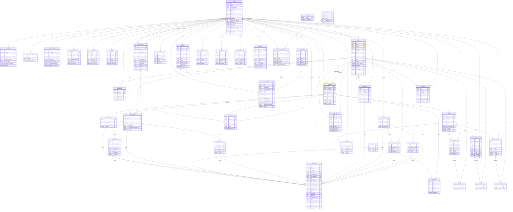

```mermaid
erDiagram
    users {
        string id PK
        string email
        string password_hash
        string google_id
        string full_name
        string role
        boolean is_active
        boolean is_verified
        int failed_login_attempts
        datetime locked_until
        datetime last_activity
        datetime revoked_at
        datetime last_password_change
        datetime created_at
        datetime updated_at
    }
    user_profiles {
        string id PK
        string user_id FK
        text bio
        json skills_json
        json questionnaire_json
        string guide_status
        boolean onboarding_completed
        datetime updated_at
    }
    privacy_settings {
        string user_id PK
        string visibility
        boolean show_contact_info
    }
    notification_settings {
        string user_id PK
        boolean is_enabled
        boolean email_enabled
        boolean sms_enabled
        boolean push_enabled
        boolean marketing_enabled
        boolean team_updates_enabled
        boolean billing_alerts_enabled
    }
    account_verifications {
        string id PK
        string user_id FK
        string otp_hash
        string verification_type
        datetime expires_at
        datetime created_at
    }
    security_logs {
        string id PK
        string user_id FK
        string event_type
        json details
        string ip_address
        datetime created_at
    }
    %% user_id nullable
    audit_logs {
        string id PK
        string user_id FK
        string action
        json details
        string ip_address
        datetime created_at
    }
    %% user_id nullable (SET NULL on delete)
    token_blacklist {
        string token PK
        datetime blacklisted_at
    }
    ideas {
        string id PK
        string owner_id FK
        string business_id FK
        string title
        text description
        string status
        float ai_score
        float budget
        json skills
        float feasibility
        boolean is_score_outdated
        boolean is_archived
        datetime archived_at
        datetime converted_at
        datetime created_at
        datetime updated_at
    }
    %% business_id nullable until linked to a converted business
    idea_versions {
        string id PK
        string idea_id FK
        string created_by FK
        json snapshot_json
        datetime created_at
    }
    idea_metrics {
        string id PK
        string idea_id FK
        string created_by FK
        string name
        float value
        string type
        datetime recorded_at
    }
    experiments {
        string id PK
        string idea_id FK
        string created_by FK
        string hypothesis
        string status
        text result_summary
        datetime created_at
    }
    businesses {
        string id PK
        string idea_id FK
        string owner_id FK
        string stage
        json context_json
        boolean is_archived
        datetime archived_at
        datetime created_at
        datetime updated_at
    }
    %% idea_id nullable (business may exist without originating idea)
    business_roadmaps {
        string id PK
        string business_id FK
        float completion_percentage
        datetime created_at
    }
    roadmap_stages {
        string id PK
        string roadmap_id FK
        int order_index
        string stage_type
        string status
        json output_json
        datetime completed_at
    }
    agents {
        string id PK
        string name
        string phase
    }
    agent_runs {
        string id PK
        string ai_type
        string roadmap_id FK
        string stage_id FK
        string chat_session_id FK
        string chat_message_id FK
        string idea_id FK
        string idea_metric_id FK
        string idea_comparison_id FK
        string comparison_item_id FK
        string comparison_metric_id FK
        string experiment_id FK
        string agent_id FK
        json input_data
        json output_data
        float confidence_score
        string status
        int execution_time_ms
        json critique_json
        boolean threshold_passed
        datetime created_at
    }

    embeddings {
        string id PK
        string business_id FK
        string agent_id FK
        text content
        string vector
        datetime created_at
    }
    plans {
        string id PK
        string name
        decimal price
        json features_json
        boolean is_active
    }
    subscriptions {
        string id PK
        string user_id FK
        string plan_id FK
        string status
        datetime start_date
        datetime end_date
        string paypal_subscription_id
    }
    payment_methods {
        string id PK
        string user_id FK
        string provider
        string token_ref
        string last4
        boolean is_default
        datetime created_at
    }
    payments {
        string id PK
        string user_id FK
        string subscription_id FK
        string payment_method_id FK
        decimal amount
        string currency
        string status
        string paypal_order_id
        string paypal_capture_id
        string paymob_order_id
        string paymob_transaction_id
        datetime created_at
    }
    usages {
        string id PK
        string user_id FK
        string resource_type
        int used
        int limit_value
    }
    groups {
        string id PK
        string business_id FK
        string name
        string description
        string default_role
        boolean is_chat_enabled
        datetime created_at
        datetime updated_at
    }
    group_members {
        string id PK
        string group_id FK
        string user_id FK
        string role
        string status
        datetime joined_at
    }
    group_member_idea_access {
        string member_id FK
        string idea_id FK
    }
    group_invites {
        string id PK
        string group_id FK
        string email
        string token
        string role
        string status
        string invited_by FK
        datetime expires_at
        datetime created_at
    }
    group_invite_idea_access {
        string invite_id FK
        string idea_id FK
    }
    group_join_requests {
        string id PK
        string group_id FK
        string user_id FK
        string role
        string status
        datetime created_at
        datetime updated_at
    }
    group_request_idea_access {
        string request_id FK
        string idea_id FK
    }
    group_messages {
        string id PK
        string group_id FK
        string sender_id FK
        text content
        datetime created_at
    }
    %% Partner onboarding: application + admin review. Marketplace listing = subset APPROVED (no extra table).
    partner_profiles {
        string id PK
        string user_id FK
        string partner_type
        string company_name
        text description
        json services_json
        json experience_json
        json documents_json
        string approval_status
        string approved_by FK
        datetime approved_at
        datetime created_at
    }
    %% partner_id -> partner_profiles.id; status PENDING|ACCEPTED|REJECTED
    partner_requests {
        string id PK
        string business_id FK
        string partner_id FK
        string requested_by FK
        string status
        datetime created_at
    }
    chat_sessions {
        string id PK
        string user_id FK
        string business_id FK
        string idea_id FK
        string session_type
        json conversation_summary_json
        datetime created_at
    }
    %% business_id and idea_id optional (session context)
    chat_messages {
        string id PK
        string session_id FK
        string role
        text content
        datetime created_at
    }
    notifications {
        string id PK
        string user_id FK
        string title
        text content
        text message
        string type
        string status
        string delivery_status
        int retry_count
        datetime expires_at
        datetime created_at
    }
    share_links {
        string id PK
        string idea_id FK
        string business_id FK
        string created_by FK
        string token
        boolean is_public
        datetime expires_at
        datetime created_at
    }
    files {
        string id PK
        string owner_id FK
        string file_path
        string file_type
        int size
        datetime uploaded_at
    }
    documents {
        string id PK
        string filename
        string content_type
        text extracted_text
        string user_id FK
        datetime created_at
    }
    admin_action_logs {
        string id PK
        string admin_id FK
        string action_type
        string target_entity
        uuid target_id
        datetime created_at
    }
    idea_comparisons {
        string id PK
        string user_id FK
        string name
        datetime created_at
    }
    comparison_items {
        string id PK
        string comparison_id FK
        string idea_id FK
        int rank_index
    }
    comparison_metrics {
        string id PK
        string comparison_id FK
        string metric_name
        float value
    }
    %% comparison_metrics.value nullable in DB
    export_jobs {
        string id PK
        string user_id FK
        json scope
        string format
        string status
        string storage_path
        string task_id
        json error_details
        datetime completed_at
        datetime created_at
    }
    users ||--o| user_profiles : has
    users ||--o| privacy_settings : has
    users ||--o| notification_settings : has
    users ||--o{ account_verifications : verified_via
    users ||--o{ security_logs : logs
    users ||--o{ audit_logs : audits
    users ||--o{ ideas : owns
    ideas ||--o{ idea_versions : has_versions
    users ||--o{ idea_versions : created_by
    ideas ||--o{ idea_metrics : has_metrics
    users ||--o{ idea_metrics : created_by
    ideas ||--o{ experiments : has_experiments
    users ||--o{ experiments : created_by
    users ||--o{ businesses : owns
    ideas }o--o| businesses : linked_business
    businesses }o--o| ideas : source_idea
    businesses ||--o| business_roadmaps : has_roadmap
    business_roadmaps ||--o{ roadmap_stages : has_stages
    business_roadmaps ||--o{ agent_runs : triggers
    roadmap_stages ||--o{ agent_runs : triggers
    agents |o--o{ agent_runs : executes

    agents ||--o{ embeddings : creates
    businesses ||--o{ embeddings : embedded
    chat_sessions ||--o{ agent_runs : triggers
    chat_messages ||--o{ agent_runs : triggers
    ideas ||--o{ agent_runs : triggers
    idea_metrics ||--o{ agent_runs : triggers
    idea_comparisons ||--o{ agent_runs : triggers
    comparison_items ||--o{ agent_runs : triggers
    comparison_metrics ||--o{ agent_runs : triggers
    experiments ||--o{ agent_runs : triggers
    users ||--o{ subscriptions : subscribes
    plans ||--o{ subscriptions : in_plan
    users ||--o{ payment_methods : has
    users ||--o{ payments : makes
    subscriptions ||--o{ payments : billed_via
    payment_methods ||--o{ payments : used_in
    users ||--o{ usages : tracked
    businesses ||--o| groups : has
    groups ||--o{ group_members : contains
    users ||--o{ group_members : member_of
    group_members ||--o{ group_member_idea_access : has_access
    ideas ||--o{ group_member_idea_access : accessed_by
    groups ||--o{ group_invites : sends
    users ||--o{ group_invites : invited_by
    group_invites ||--o{ group_invite_idea_access : has_access
    ideas ||--o{ group_invite_idea_access : accessed_by
    groups ||--o{ group_join_requests : receives
    users ||--o{ group_join_requests : requests
    group_join_requests ||--o{ group_request_idea_access : has_access
    ideas ||--o{ group_request_idea_access : accessed_by
    groups ||--o{ group_messages : has
    users ||--o{ group_messages : sends
    users ||--o| partner_profiles : has_profile
    users ||--o{ partner_profiles : approves
    partner_profiles ||--o{ partner_requests : receives
    businesses ||--o{ partner_requests : sends
    users ||--o{ partner_requests : submits
    users ||--o{ chat_sessions : starts
    businesses ||--o{ chat_sessions : context
    ideas ||--o{ chat_sessions : context
    chat_sessions ||--o{ chat_messages : contains
    users ||--o{ notifications : receives
    users ||--o{ share_links : creates
    businesses ||--o{ share_links : shared
    ideas ||--o{ share_links : shared
    users ||--o{ files : owns
    users ||--o{ documents : uploads
    users ||--o{ admin_action_logs : performed_by
    users ||--o{ idea_comparisons : compares
    idea_comparisons ||--o{ comparison_items : contains
    ideas ||--o{ comparison_items : in_comparison
    idea_comparisons ||--o{ comparison_metrics : uses
    users ||--o{ export_jobs : exports
```
