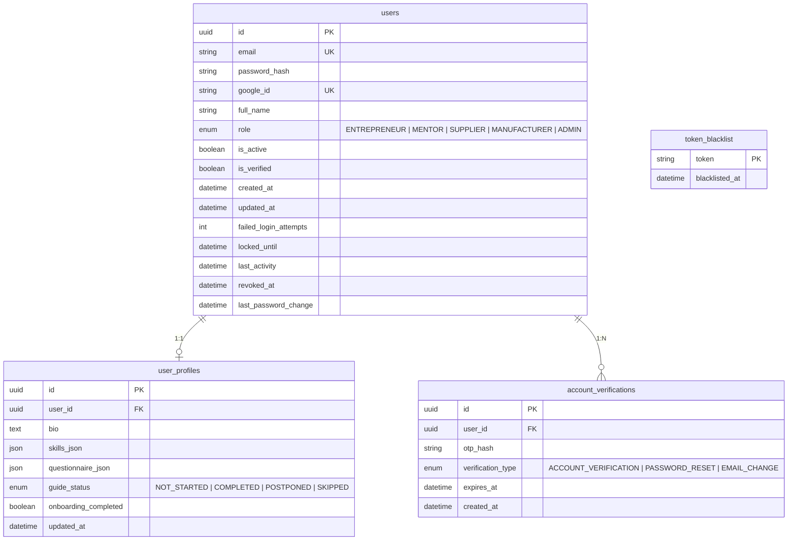
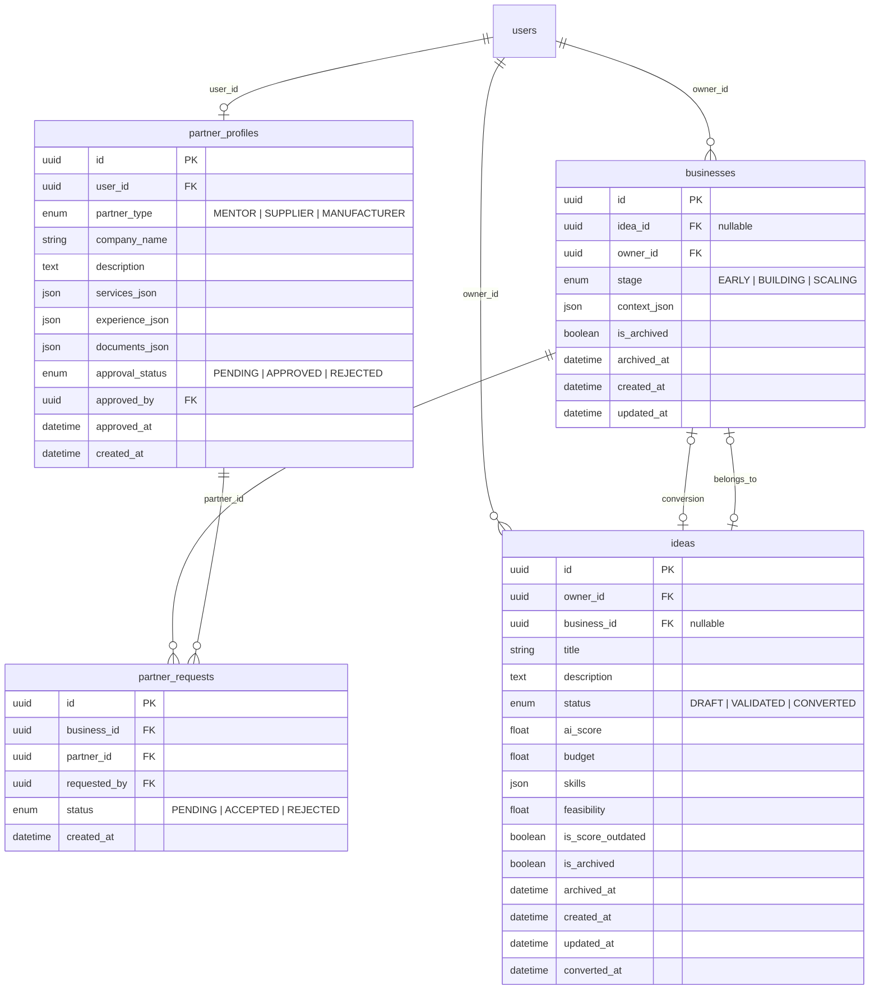
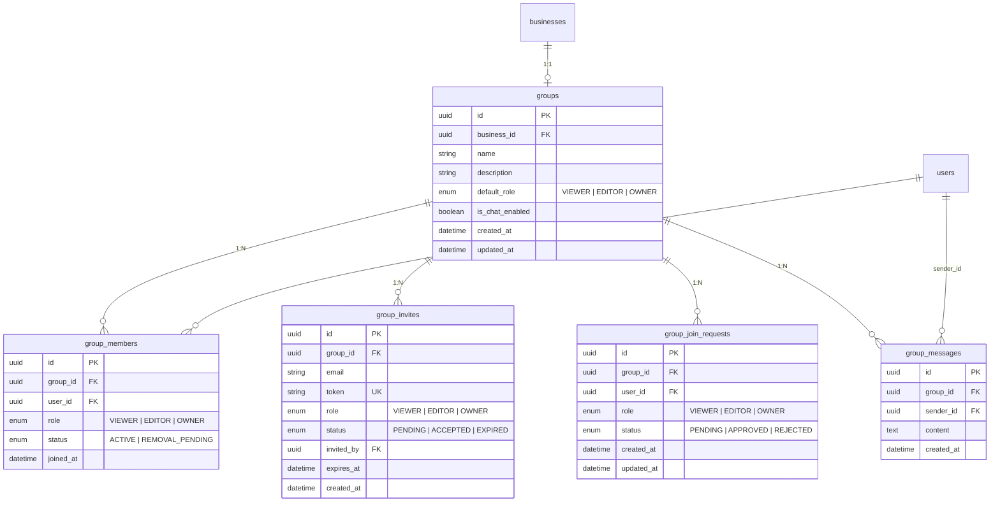
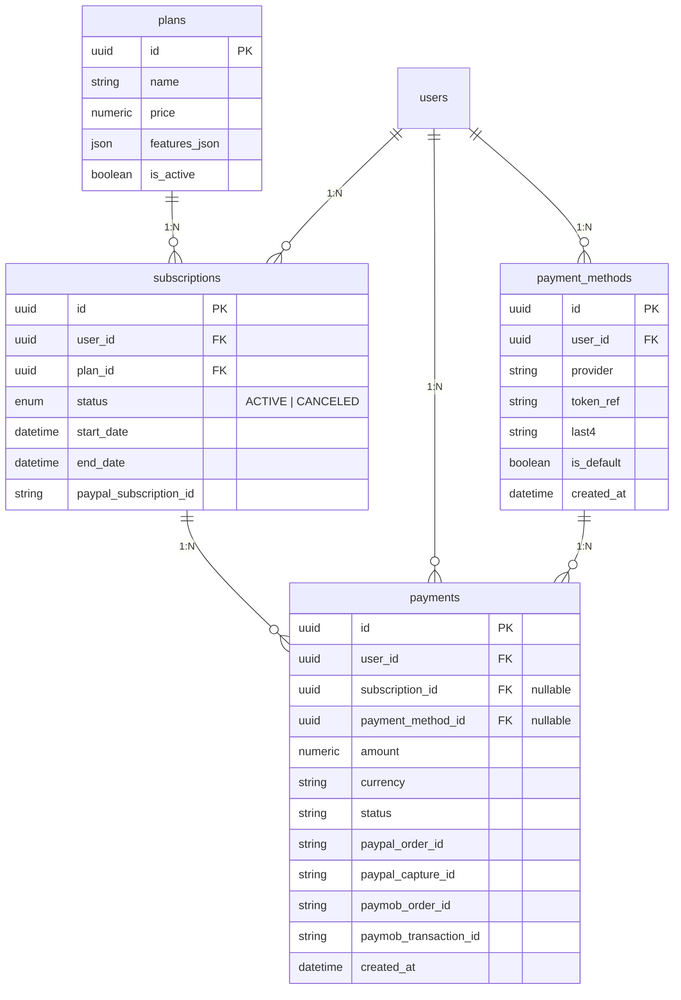
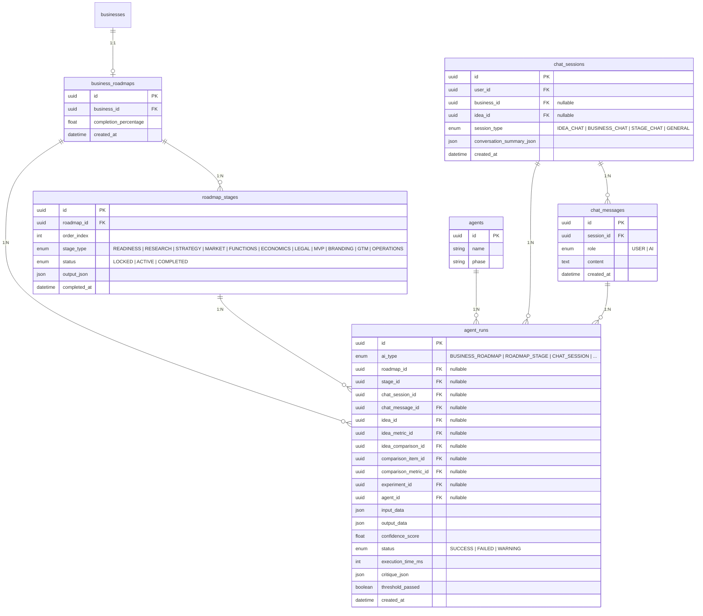
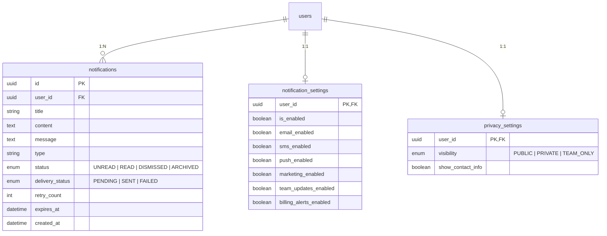
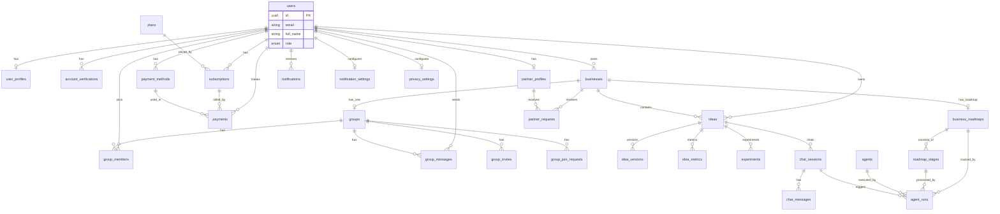
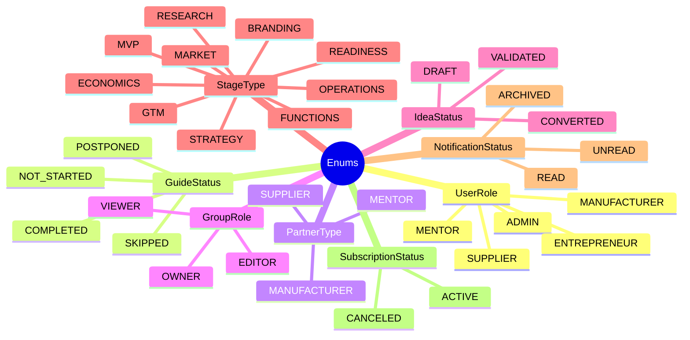

# Bizify Database Schema (Mermaid ER Diagrams)

## 1. User Domain

## 2. Business Domain

## 3. Group Domain

## 4. Subscription & Billing Domain

## 5. AI / Roadmap Domain

## 6. Notifications & Settings Domain

## 7. Full Entity Relationship Diagram

## Enum Reference

## Table List

| # | Table | Domain |
|---|-------|--------|
| 1 | `users` | User |
| 2 | `user_profiles` | User |
| 3 | `account_verifications` | User |
| 4 | `token_blacklist` | User |
| 5 | `businesses` | Business |
| 6 | `ideas` | Business |
| 7 | `idea_versions` | AI |
| 8 | `idea_metrics` | AI |
| 9 | `experiments` | AI |
| 10 | `partner_profiles` | Business |
| 11 | `partner_requests` | Business |
| 12 | `groups` | Group |
| 13 | `group_members` | Group |
| 14 | `group_member_idea_access` | Group (assoc) |
| 15 | `group_invites` | Group |
| 16 | `group_invite_idea_access` | Group (assoc) |
| 17 | `group_join_requests` | Group |
| 18 | `group_request_idea_access` | Group (assoc) |
| 19 | `group_messages` | Group |
| 20 | `plans` | Billing |
| 21 | `subscriptions` | Billing |
| 22 | `payments` | Billing |
| 23 | `payment_methods` | Billing |
| 24 | `business_roadmaps` | AI |
| 25 | `roadmap_stages` | AI |
| 26 | `agents` | AI |
| 27 | `agent_runs` | AI |
| 28 | `chat_sessions` | AI |
| 29 | `chat_messages` | AI |
| 30 | `idea_comparisons` | AI |
| 31 | `comparison_items` | AI |
| 32 | `comparison_metrics` | AI |
| 33 | `embeddings` | AI |
| 34 | `documents` | AI |
| 35 | `notifications` | Notification |
| 36 | `notification_settings` | Notification |
| 37 | `privacy_settings` | Notification |
| 38 | `share_links` | Utility |
| 39 | `export_jobs` | Utility |
| 40 | `files` | Utility |
| 41 | `usages` | Utility |
| 42 | `audit_logs` | Logging |
| 43 | `admin_action_logs` | Logging |
| 44 | `security_logs` | Logging |
